======================
Plomino 1.3 user guide
======================

:Author: Eric Brehault
:Editor: Jean Jordaan <jean.jordaan@gmail.com>
:Contact: contact@makina-corpus.com
:Revision: Version 1.0 - January 2009
:Date: 2009-02-02
:Copyright: This document has been placed in the public domain.

-------------------
About this Document
-------------------

This document is aimed at Plomino application designers and managers. It
applies to Plomino 1.3.

This document is published under the **Creative Commons by-sa-nc**
licence.

You are free:

- to **Share**: to copy, distribute and transmit the work

- to **Remix**: to adapt the work

Under the following conditions:

- **Attribution**. You must attribute the work in the manner specified by
  the author or licensor (but not in any way that suggests that they
  endorse you or your use of the work). 

- **Non commercial**. You may not use this work for commercial purposes.

- **Share Alike**. If you alter, transform, or build upon this work, you
  may distribute the resulting work only under the same or similar
  license to this one.

------------
Introduction
------------

The main objective of Plomino is to provide the ability to build
business-specific applications in Plone without requiring development of
Plone product.

Plomino allows you to create forms, to use those forms to view or edit
structured contents, to filter and list those contents, to perform
search requests, to add business-specific features and to automate
complex processing -- all entirely through the Plone web interface.

.. Note:: 
    Plomino is widely inspired by the IBM Lotus Domino (tm) commercial
    product, it reproduces its main concepts and features, and it uses
    its terminology (which sometimes overlaps with the Plone
    terminology).

--------
Concepts
--------

Plomino database
================

A Plomino *application* is supported by a Plomino *database*.

The Plomino database is the Plone object which contains the application
data (i.e. the documents; see below), and its structure (i.e. the
design; see below).

Forms
=====

A *form* allows users to view and/or to edit information.

A form contains some fields of different types (text, date, rich text,
checkbox, attached files, etc.).

The application designer designs the layout he needs for the form, and
inserts the fields wherever he wants.

A form can also contain some action buttons to trigger specific
processing.

Documents
=========

A *document* is a set of data. Data can be submitted by a user using a
given form.

Important note: a document can be created using one form and then viewed
or edited using a different form. This mechanism allows the document
rendering and the displayed action buttons to change according to
different parameters (user access rights, current document state, field
values, etc.).

Views
=====

A *view* allows a list of documents to be displayed.

A view has a selection formula which filters the documents the
application designer wants to be displayed in the view.

A view contains columns. Column contents is computed using data stored
in the documents.

Search
======

The application designer can create specific forms dedicated to performs
search requests (those forms will not be used to create documents but to
input the request criteria).

It allows the designer to provide more accurate and more
business-oriented search features than the global Plone search.

Design
======

A Plomino application design is the set of forms and views provided in
the Plomino database.

The design defines the structure of the application, and it is created
by the application designer. It differs from the documents, which are
the application data, created by the users.


----------------------------------
Build a simple Plomino application
----------------------------------

Create a Plomino database
=========================

To create a Plomino database, select ``Plomino: database`` in the **Add item** Plone menu

.. image:: images/m440f207a.png

Enter a title for the database (for instance: Books) and save it.

Add a form
==========

To add a form, select ``Plomino: form`` in the **Add item** Plone menu.

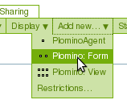

Enter the form id. The form id is initialized with a generated value
(for instance: ``plominoform.2008-01-31.9797530894``). It is preferable
to replace it with a more meaningful id (for instance: ``frmBook``). It
is a technical identifier, so use basic characters and numbers only
(blank space and special characters are forbidden).

In Title, enter the form label, which will be displayed to the users
(for instance: ``Book description``.

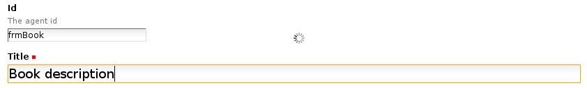

Save.

Add fields
==========

To add a field, select ``Plomino: field`` in the Plone Add item menu. 

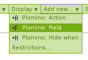

Like for Form, the id should be changed, and title must be completed.

Create a 'bookAuthor' field, with type 'Text', and check 'Add in index': 

.. image:: images/m730203ab.png

and save.

Do the same for the following fields:

- 'bookTitle', type 'Text', Add in index 
- 'publicationYear', type 'Number', Add in index 
- 'summary', type 'Rich text', Add in index 
- 'cover', type 'File attachment' 
- 'bookCategory', type 'Selection list', Add in index

Once the bookCategory field saved, go its Settings tab. 

.. image:: images/m472f3e6a.png

and enter in Selection list the possible values : 

.. image:: images/m37199d48.png

Create the form layout
======================

Go back to the frmBook form object and click on the **Edit** tab.

In Form layout, you can create the layout you want using the Kupu
editor.

You indicate the area where a given field should be displayed by
entering its field id and applying the ``Plomino field`` style on it: 

.. image:: images/62293509.png 

The field will be displayed in Kupu in blue and dashed.

Save the modification.

Use the form
============

Go back to the Books database, the database welcome page now contains a
link to add a new document using the ``Book description`` form:

.. image:: images/49f39a7c.png

Click on this link, and you get the form displayed as designed in the
kupu editor and including the fields as they have been defined: 

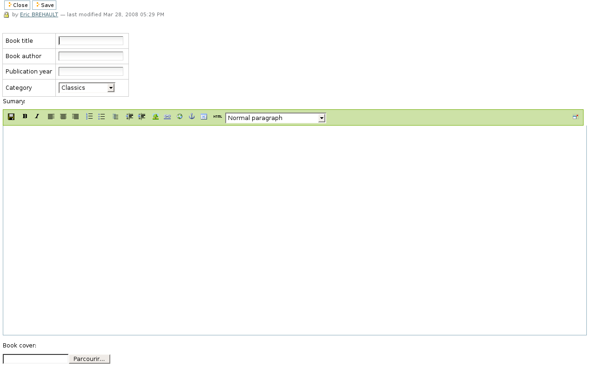

You can enter values and save, it will create a new document: 

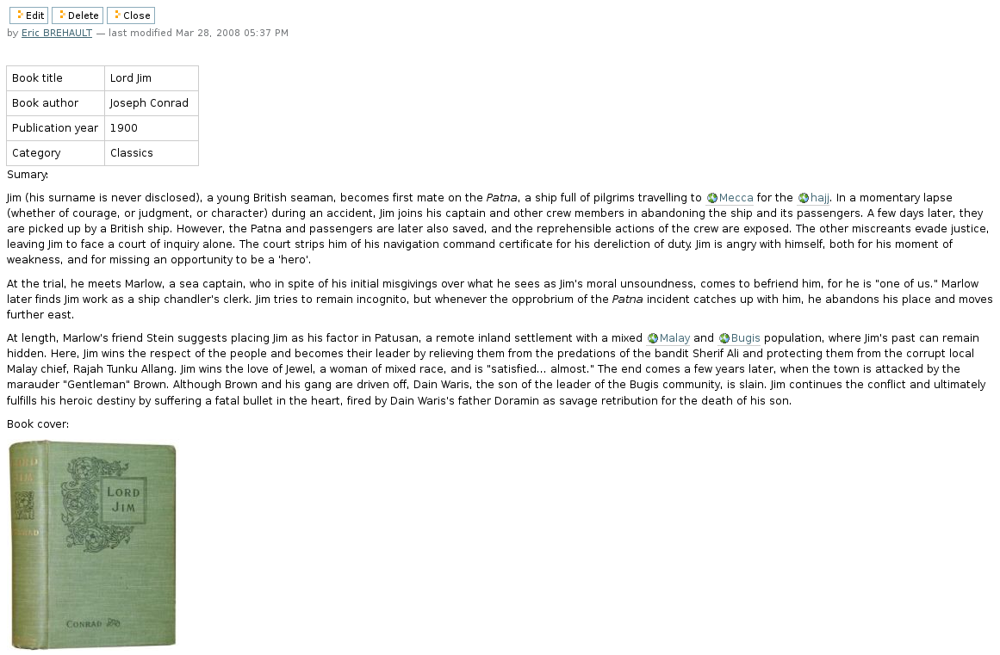


Explore the database design
===========================

Go to the Books database and click the **Design** tab.

This tab displays all the design elements contained in the database: 

.. image:: images/2d8bbc56.png 

The pencil icon gives access to the corresponding object in edit mode,
the page icon in read mode, and the folder icon in content mode.

Change the document title
=========================

As you can see on the document you have just created with the frmBook
form, the title is a meaningless identifier: 

.. image:: images/4014d979.png

To display a more meaningful title, go to the frmBook object, edit it,
go to **Parameters** tab, and enter the following formula in Document
title::

    "Information about "+plominoDocument.bookTitle +" ("+plominoDocument.bookAuthor+")"

Save the form, go back to the document, make a change and save it (so it
is refreshed), and you get the title as specified in the formula: 


'Document title' is computed by a formula. As all the entry points
allowing formula usage in Plomino, it is a Python expression where
``plominoDocument`` is the current document.

All the document items values are accessible as object attributes
(`plominoDocument.<field name>`).

For more information about formulas, see below.

Add a view
==========

Go back to the Books database.

Select ``Plomino: view`` in the **Add item** Plone menu. Enter an
identifier ('all') and a title ('All the books'):

.. image:: images/m57ed2659.png

Enter a selection formula too: this formula must return `True` or
`False.` It is evaluated for each document, if the returned value is
`True`, the document is displayed in the view, if `False`, it is
rejected.

Enter the following expression::

    True

(this expression always return `True`, so all the documents will be
displayed).

Save.

You get the following result: 

.. image:: images/m64d1e0e7.png

We just see a link '**Go**' which allows us to access the document we
have created. Now we need to add columns to this view.

Add columns
===========

Select ``Plomino: column`` in the **Add item** Plone menu.

Enter an identifier and a title, and enter a formula to compute the
column value, for instance::

    plominoDocument.bookTitle

Then, enter the column position. 

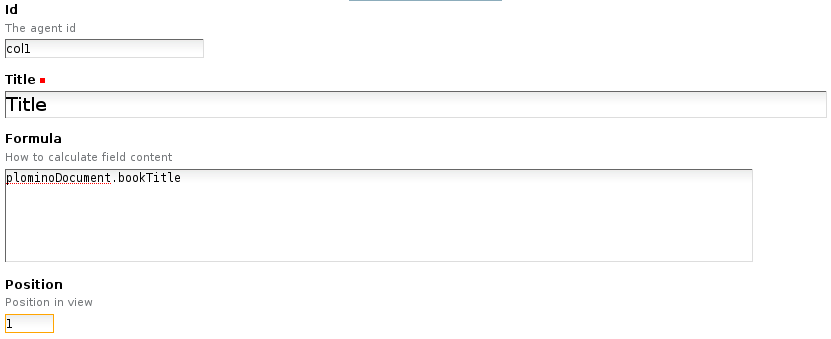


Similarly, add a column to display bookAuthor.

If you go back to the Books database root, the view is proposed in the
Browse section: 

.. image:: images/m12df968f.png

Create more documents. When you click on the link 'All the books', the
view is displayed with its 2 columns (and its new documents): 

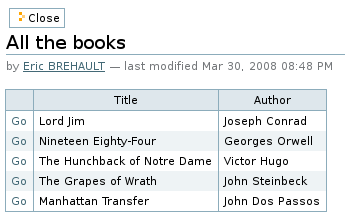

To improve browsing of the documents, it could be useful to sort the
view.

To do that, click on **Edit**, go to the **Sorting** tab and enter
``col1`` in the **Sorting** column, then save: 

.. image:: images/193e0720.png


Add more views
==============

You can add as many views as necessary.

You can build views able to filter the documents; for instance if you
enter the following selection formula::

    plominoDocument.publicationYear >=1800 and plominoDocument.publicationYear <1900

you will only list the XIXth century books.

You can create categorised views: create a view with a first column
which contains the `bookCategory` field value, and select
**Categorised** in the **Sorting** tab: 

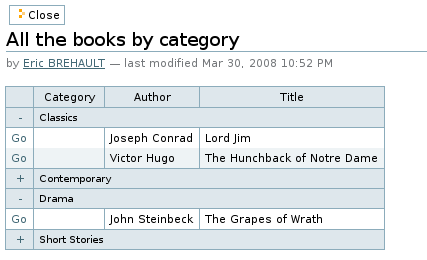

Each category can be expanded or collapsed. 


Add a search form
=================

Create a new form named ``frmSearch``, and add some fields with the same
identifiers as the documents fields you want to be able to search; for
instance: bookTitle, bookAuthor and bookCategory.

In the **Parameters** tab, select 'Search form' and enter ``all`` in 'Search view': 

.. image:: images/22e7de63.png

This form is now proposed in the Search section in the Books database root: 

.. image:: images/197da1a1.png

If you click on this link, you get the search form, and if you enter
some criteria, the results are displayed under the form: 

.. image:: images/m54d2b2e2.png

.. Note:: 
    the criteria are effective only if the field names match the
    document item names.


``About`` and ``Using`` pages
=============================

Go to the Books database **Edit** tab. You can fill in the ``About this
database`` section and the ``Using this database`` section.

Information entered here will be available in the **About** and the
**Using** tabs. It allows you to offer users a page to describe the
purpose of the application and another one to give a short user guide.

--------------
Access control
--------------

Standard Plomino access rights
==============================

Plomino offers 5 standard access levels for any Plomino database:

- *Reader*: can read any document, perform searches, but cannot create
  new documents or modify existing ones.

- *Author*: Reader + can create new documents, and modify/delete only
  documents he/she has created.

- *Editor*: Author + can modify/delete any documents.

- *Designer*: Editor + can change the database design.

- *Manager*: Designer + can change the access rights.

These rights can be granted to Plone members and/or to Plone groups.

Generic users
=============

Plomino handles 2 types of generic users:

- *Anonymous*: users not authenticated on the Plone site.

- *Authenticated*: any authenticated user.

The Plomino standard access rights can be applied to those 2 generic
users, but an anonymous user will never be able to delete a document.

.. Note:: 
    as nothing can differentiate an anonymous user from another one,
    this rule allows to make sure no one will delete a document created
    by someone else.

Roles
=====

Some applications may need to provide, for specific users, a specific
behaviour which is beyond the basic access rights mechanism we have just
described.

Plomino allows you to create roles which can be applied to Plone users.

By default, a role does not grant any extra rights, but the application
designer will use them as markers to enable specific behaviours in his
application.

For instance, if you build a Plomino application to handle purchase
requests, all the employees will be able to use the form to submit a
purchase request, but only the users with the `[FinancialReponsible]`
role would be able to modify the **Approval** section in this form.

.. Note:: roles are always noted with brackets.

Manage the access rights
========================

Access rights are managed in the tab named **ACL** (Access Control List). 

.. image:: images/30eab40c.png 

----------------
Fields reference
----------------

General parameters
==================

id
    :Value:
        Free text. 
        
        It mustn't contain special characters or spaces.
    :Purpose:
        Field identifier. It is used in Plomino formulas to identify the
        corresponding document item.                                                                   
Field type
    :Value:
        - Selection list 
        - Name 
        - Text 
        - Number 
        - Date/Time 
        - File attachment 
        - Rich text 
        - Doclink                                
    :Purpose:
        Depending on the field type, the values entered in the field
        and/or the rendering of the field might be different. (See
        Type-specific parameters.)
Field mode
    :Value:
        - Editable 
        - Computed 
        - Computed for display 
        - Computed on creation
    :Purpose:
        When editable, a field value can be entered by the user.
        Otherwise, its value is computed using a formula. See Advanced
        features -- Computed field.
Formula
    :Value:
        Python code
    :Purpose:
        Depending on the field mode, this formula will compute the field
        value (if computed), or just its default initial value (if
        editable).
Field read template and field edit template
    :Value:
        .PT template id
    :Purpose:
        The custom .pt template to use to render the field. See Advanced
        features -- Field template.
Validation formula
    :Value:
        Python code
    :Purpose:
        The validation formula must return a string containing the error
        message if the validation failed, or an empty string is the
        validation was successful.
Add to index
    :Value:
        True/False
    :Purpose:
        If `True`, the field is added to the database index, allowing to
        perform search on its values.


Type-specific parameters
========================

Type-specific parameters are available in the field's Settings tab:

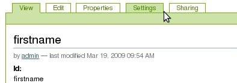

Text field
----------

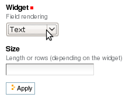

Widget
    :Value:
        - ``Text``      
        - ``Long text`` 
    :Purpose: Text is rendered as a basic HTML input text field.
Size
    :Value: Integer       
    :Purpose: 
        - If Text widget: input text size.
        - If Long text: textarea rows.

.. image:: images/m1f045a32.png

Selection list field
--------------------

Widget
    :Value: - ``Selection list``
            - ``Multi selection list``
            - ``Checkboxes``
            - ``Radio buttons``
    :Purpose: Note: multi selection list and checkboxes are multi-valued.
Selection list 
    :Value: List of strings
    :Purpose:
        The possible values selectable in the field.

        Note: if a value contains a pipe (`|`), Plomino uses the string
        *before* the pipe as the entry label, and the string *after* as the
        real value. 

        Example: ```United states of America|USA```
Selection list formula 
    :Value: Python script
    :Purpose: 
        The formula must return the list of values selectable in the
        field (using the ```label|value``` format if necessary).

        Note: if a Selection list formula is provided, it overrides the
        Selection list to provide the field value list.
Separator 
    :Value: String
    :Purpose: 
        Used to separate the values in read mode for multi-valued fields
        and also in edit mode for radio buttons and checkboxes.

        Default is blank.

        Examples: ``;-,``


Name field
----------

.. image:: images/m608450e8.png

Type
    :Value: 
        - ``Single valued``
        - ``Multi valued``
Separator
    :Value: String
    :Purpose:
          Used to separate the values in read mode.

          Default is blank.

          Examples: ``;-,``


Number field
------------

.. image:: images/m22b77a8c.png

Type
    :Value:
        - ``Integer``
        - ``Float``
Size
    :Value:
        Integer
    :Purpose:
        Length of the HTML input.


Date/Time field
---------------

.. image:: images/m3e60ec56.png

Format
    :Value:
          Python date pattern
    :Purpose:
          Example: `%d/%m/%Y`

          If empty, default to the Database default date format.
Starting year
    :Value:
          Integer
    :Purpose:
          Earliest year selectable using the date/time widget.

          If empty, default to the Plone site default starting year.


File attachment field
---------------------

No specific parameters.

Rich text field
---------------

No specific parameters.

Doclink field
-------------

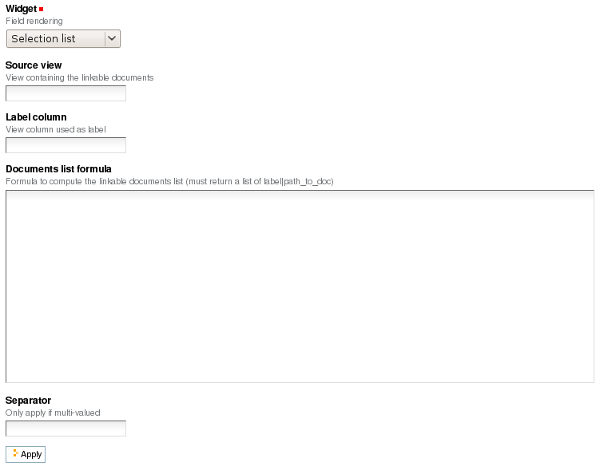

Widget
    :Value:
        - ``Selection list``
        - ``Multi-selection list``
        - ``Embedded view``
    :Purpose:
          If *Embedded view* is selected, the view itself is displayed,
          with a check box on each row to allow the user to select a
          document.
Source view
    :Value:
          The targeted view
Label column
    :Value:
          The column used to provide the list labels
    :Purpose: 
          Only apply if Selection list or Multi selection list
Documents list formula
    :Value: 
          Python script
    :Purpose: 
          This formula must return a list of string values formatted as follows::

            ```lable|path_to_document```

          Notes:
          - it might a path to any kind of Plone object (even if the main purpose is to link to Plomino Documents),
          - if a formula is provided, it overrides Source view and Label column.
Separator
    :Value: 
          String
    :Purpose: 
          Used to separate the links in read mode.

          Default is blank.

          Examples: ``;-,``


------------------
Features reference
------------------

Formulas
========

Formulas are Python expressions.

If it is a one line expression, the returned value corresponds to the
Python expression evaluation. Example::

    plominoDocument.price*15

return the value ``price`` multiplied by 15.

But if the expression consists of several lines, you must use ``return``
to specify the value to return. Example::

    total_price=plominoDocument.purchasePrice + plominoDocument.productionCosts 
    taxes=total_price*0,196 
    return taxes

And if you just write::

    total_price=plominoDocument.purchasePrice + plominoDocument.productionCosts
    total_price*0,196

no value would be returned.

.. Note::
    a formula is not necessarily required to return a value -- you may
    just need to make some changes in some documents (for instance if it
    is the formula in a Plomino action), so the return value would be
    irrelevant.

``plominoDocument`` is a reserved keyword which corresponds to the
current document on which the formula is evaluated.

You can use ``plominoContext`` as a synonym of ``plominoDocument``,
because in some cases the formula is executed on an object which is not
a Plomino document (but a view, or a form, for instance).In those cases,
``plominoContext`` will be prefered to avoird confusion.

The document items can be accessed as if they were attributes, or using
the `getItem()` method: ``plominoDocument.validationDate`` is equivalent to: 
``plominoDocument.getItem('validationDate')``. 

.. Note:: 
    there is still a small difference, because if an item does not
    exist, the attribute notation will produce an error, whereas
    `getItem` will return an empty string ``''``.

To change an item value, use the `setItem()` method: 
``plominoDocument.setItem('firstname', 'Eric')``

You can access the parent Plomino database of the document (or view, or
form, according the context) using the `getParentDatabase()` method.

You can also access the views and the other documents. Example::

    db=plominoDocument.getParentDatabase() 
    view=db.getView('pendingPurchases') 
    total=0 
    for doc in view.getAllDocuments(): 
        total=total+doc.price 
    return total

(this example computes the total amount for the pending purchase requests).

You can check the current user rights or roles. Example::

    db=plominoDocument.getParentDatabase() 
    user=db.getCurrentUser() 
    if db.hasUserRole(user, '[Expert]'): 
        return True 
    elif db.isCurrentUserAuthor(doc): 
        return True 
    elif 'PlominoEditor' in db.getCurrentUserRights(): 
        return True 
    else: 
        return False

You can change the author access rights on a given document by modifying
its `Plomino_Authors` item.

This item is created automatically for any document and contains the
user id of the document creator. If you want your document to be
editable by users other than its creator, it can contain other ids as
well. Example::

    authors=plominoDocument.getItem('Plomino_Authors') 
    authors.append('[Expert]') 
    if not 'inewton' in authors: 
        authors.append('inewton') 
    plominoDocument.setItem('Plomino_Authors', authors)

As you can see in this example, you can add user ids and/or user roles.

For a better understanding of the methods available on Plomino objects,
see below in this document.

Actions
=======

By default, Plomino offers few standard actions (**Exit**, **Save**,
**Delete**, **Edit**, etc.) depending on the object type (document,
view, form), on the current mode (read mode or edit mode), and on the
user access rights.

To improve the application usability, you may need to add more actions
in the forms or in the views.

To create an action, select ``Plomino: action`` in the **Add item**
Plone menu.

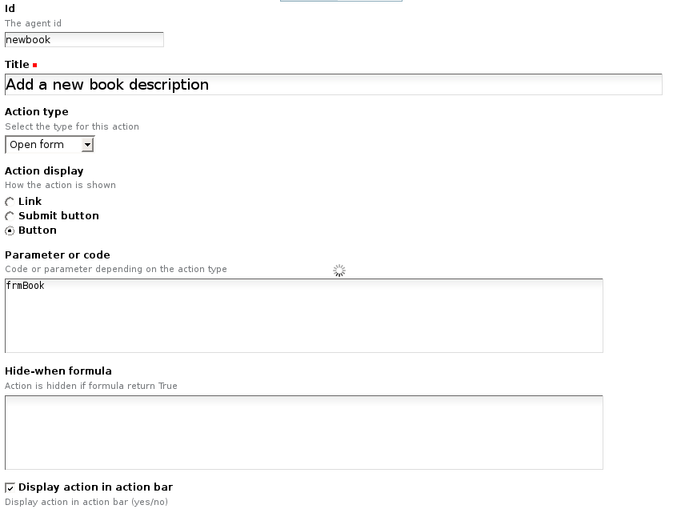

Enter an identifier and a title.

Then select the action type:

- Open form: open the form indicated by the ``Parameter or code``
  parameter to create a new document.

- Open view: open the view indicated by the ``Parameter or code``
  parameter.

- Close: go back to the database home page.

- Save: submit the form with its current content, and save (or create)
  the document.

- Python script: run the formula entered in ``Parameter or code``, and
  redirect to the current object (in read mode). Examples: send a mail
  notification to someone, compute a field value and update the document
  with this new value, etc.

- Redirect: same as ``Python script``, but the formula should return an
  URL that will be used for redirection. Example: create a new document
  using some values from the current document, and automatically open
  this new document.

You can add a *hide-when* formula to control when the action should be
visible or not.

If you select ``Display action in action bar``, the action will be
displayed together with the standard Plomino actions in the action bar.

Example:

.. image:: images/m2899c882.png

But (in forms only) you can also choose to insert the action within the
form layout directly. You must use the *Plomino action* style in Kupu,
and the action will be rendered according the Action display parameter
(link, submit button, or button).

Example:

.. image:: images/5eabcd6.png

Result:

.. image:: images/67218c9.png


Fields
======

Computed fields
---------------

In a form, the fields where the user can enter data are in *edit* mode.

You might also need to use fields which can not be changed by the user.
Here are the other modes offered in Plomino:

Computed
    the field value is computed with a formula each time the document is
    opened, and it is saved each time the document is saved.

Computed on creation
    the field value is computed only once, the first time the document
    is saved.

Computed for display
    the field value is computed each time the document is opened, but it
    is not saved.

Example: create a computed for display field with this formula::

    category=plominoDocument.bookCategory 
    result="" 
    if not category=='': 
        index=plominoDocument.getParentDatabase().getIndex() 
        autres=index.dbsearch({'bookCategory': category}, None) 
        result="There are "+str(len(autres)-1)+" other books in the same category" 
    return result

and insert it in the frmBook form: 

.. image:: images/m434a6b5d.png 


Validation
----------

By default, Plomino validates fields according to their type (for
instance, letters are not allowed in a Number field).

You can also add more validation criteria in the field's **Validation**
tab:

- a field can be mandatory: if the field is empty when the document is
  saved, Plomino does not save the document and displays an alert to the
  user.

- you can enter a formula to implement a specific validation rule (which
  may depend on other fields values).

For instance, in a *Purchase request* application, the maximum
authorised amount is 1000 euros. You would enter the following formula
in the TotalAmount field::

    if plominoDocument.TotalAmount>1000: 
        return 'The total amount must be under 1000 euros` 
    else: 
        return '`

Note: the formula must return an empty string if validation succeeds or
an error message if it is not.

Doclinks
--------

A Doclink field allows a Plomino document to reference another document.

The doclink stores the path to the targeted document, and it is
displayed as a link.

You may use a *view* as the source of possible targeted documents.

Example
```````

We have a Contact form allowing users to enter contact information about
company employees.

The view ``allcontacts`` returns all the contact documents:

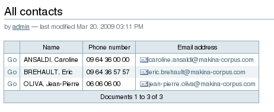

We add a doclink field, named ``manager``, in the Contact form to enter
the corresponding manager of each employee.

.. image:: images/5ef4a230.png

It uses the ``allcontacts`` view as its document list source, and
displays the ``name`` column value as label:

.. image:: images/m4fdd0770.png

In read mode, the field displays a link to the corresponding document:

.. image:: images/m52601ab7.png

If you choose the ``Embedded view`` widget, the field displays the view
itself (including all columns), with a checkbox to select documents:

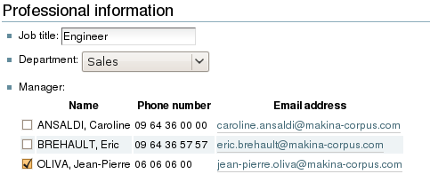

Instead of using a view, you can compute the document list using a
formula (which will override the Embedded view widget), so you can
filter the documents you want to list, you can retrieve documents from
another database, or even list Plone objects which are not Plomino
documents. For example::

    contactsdb=plominoDocument.restrictedTraverse("/Plone/demo/contacts") 
    view=contactsdb.getView('allcontacts') 
    return [d.lastname+"|"+d.getPath() for d in view.getAllDocuments()] 

.. Note::
    in this example, we use the `getAllDocuments` method to get the
    documents list, this method returns Catalog brains

    To improve performance, the ``lastname`` field has been added to the
    index, so there is no need to wake up the objects (using
    `getObject`), and we use the `getPath` method to get the path of the
    real object.
    
.. Todo: 
    Hmm, getAllDocuments doesn't sound like it will return brains, it
    sounds like it will return documents. Looking at the source code, I
    see that it does in fact return documents (``d.getObject() for d in
    res``) so this must have changed since 1.3. 

Field templates
---------------

You can create a custom template to render a field in a different way
than the regular field widgets.

The field template must be added in the Resources folder in the ZMI (go
to **Design tab/Others/Resources folder**) as a Page Template.

To be applied, the template id must be then entered in the *Field read
template* or in the *Field edit template*.

The template code can be copied from the Plomino products sources
(`CMFPlomino/skins/cmfplomino_templates/**FieldEdit.pt` or
`**FieldRead.pt`).

Here is an example showing a multi-categorized tag field:

Edit template::

    <span tal:define="
        field options/field;
        db options/field/getParentDatabase;
        categories python:
            [doc.getObject() for doc in db.getView('tags').getAllDocuments()]
        ">
    <table><tr>
    <tal:loop repeat="cat categories">
        <td valign="top" tal:define="
            c cat/tagCategory;
            tags cat/tagList
            ">
        <span tal:content="c">category</span>
        <select tal:attributes="name options/fieldname"
            multiple="true"
            lines="4">
        <tal:block repeat="v python:
            [t+'|'+c+':'+t for t in tags.split(',')]
            ">
            <tal:block define="
                current options/fieldvalue;
                l python:v.split('|')
                ">
                <option tal:attributes="
                    value python:l[1];
                    selected python:test(current and l[1] in current,1,0)
                    "
                    tal:content="python:l[0]">value</option>
            </tal:block>
        </tal:block>
        </select>
        </td>
    </tal:loop>
    </tr>
    </table>
    </span>

Result:

.. image:: images/46da1d8b.png

Read template::

    <tal:block tal:repeat="v options/selection">
        <tal:block define="
            current options/fieldvalue;
            l python:v.split('|')
            ">
            <tal:block condition="
                python:test(current and l[1] in current,1,0)">
                <tal:block define="
                    v python:l[0];
                    cat python:v.split(':')[0];
                    t python:v.split(':')[1]
                    ">
            <br/><span class="discreet" tal:content="cat">category</span>
            <span class="callout" tal:content="t">category</span>
                </tal:block>
            </tal:block>
        </tal:block>
    </tal:block>

Result:

.. image:: images/2c92d666.png


Forms
=====

Events
------

In a Plomino form, you can use the following events:

`onOpenDocument`
    executed before document is opened (in both read mode and edit mode)

`onSaveDocument`
    executed before document is saved

`onDeleteDocument`
    executed before document is deleted

`onCreateDocument`
    executed before the document is saved for the first time
    (`onSaveDocument` will also be executed, but after
    `onCreateDocument`)

In the **Events** tab, you can enter the formulas for each event you
need.

Example: enter the following formula for the `onSaveDocument` event::

    date=DateToString(DateTime()) 
    db=plominoDocument.getParentDatabase() 
    user=userFullname(db, db.getCurrentUser()) 
    plominoDocument.setItem(
        'history',
        plominoDocument.getItem('history') +
        "This document has been modified by "+user+" on "+date)

it will update the ``history`` item which logs all the modifications,
authors and dates.

Hide-when formulas
------------------

In a form, it might be useful to hide or display some sections according
different criteria (an item value, the current date, the current user's
access rights, etc.).

To do so, you must use Hide-when formulas.

Select ``Plomino: hide when`` in the **Add item** Plone menu.

Enter an identifier, a title, and a formula. Example:
``plominoDocument.bookState=='Damaged```

Then, modify the form layout to insert the hide-when formula in the form
layout. Enter the following: ``start:hide-when-identifier``
at the beginning of the area to hide. And the following at the end:
``end:hide-when-identifier``
And apply the Plomino *Hide-when* formula style to those 2 bounds:

.. image:: images/m33cfb2d3.png

If the hide-when formula returns `True`, the enclosed area will be
hidden. If it returns `False`, the area is displayed (in our example: if
the book is damaged, it cannot be borrowed, so we hide the action to
check the book availability).

Sub-forms
---------

An application can contain several forms.

In the Book library example, we could add a CD form and a Video form.
Those 2 forms would probably have several similar fields (availability,
last borrower, return date, etc.).

To avoid having to build (and maintain) the same things several times,
you can use sub-forms.

The sub-form principle is to insert a form within another form.

In our example, we create a ``borrowInfo`` form containing the
borrower name, the return date, and the availability, and we insert it
as a sub-form in ``frmBook``, ``frmCD`` and ``frmVideo``.

The form is inserted using the Plomino *Subform* style in Kupu:

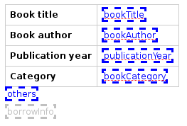

.. Note:: 
    as you probably do not want 'borrowInfo' to be displayed in the
    database home page, you have to check ``Hide in menu`` in the form
    **Parameters** tab.

Search formula
--------------

When you create a search form, Plomino uses the form fields to make a
regular ZCatalog search among the view's documents.

If needed, you can create a specific search formula in the form
**Parameters** tab.

This formula must return `True` or `False` for each document listed in
the search view.

You can access the values submitted by the search form on the REQUEST
object: `plominoContext.REQUEST.get('myfield')`.

Example::

    period=plominoContext.REQUEST.get('period') 
    if period=='Ancien regime': 
        return plominoDocument.year 
    if period=='Empire': 
        return plominoDocument.year >=1804 and plominoDocument.year

.. Note::
    Search formulas can be a lot slower than regular ZCatalog searches,
    you must use them carefully.

Page
----

Like a Search form, a Page form cannot be used to save documents;
moreover Page forms do not display any action bar.

Nevertheless, like any form, it can contain computed fields, actions
(inserted in the form layout), or hide-when formulas, so it is a good
way to build navigation pages, custom menus, or information pages (like
reports, etc.).

Example:

.. image:: images/m8490705.png

Here we create a page with 3 actions to access 3 different views, but
the last one is enclosed in a Hide-when formula so it will not be
displayed if the current user does not satisfy a given criteria. In the
example, we test if the user has the ``[dbadmin]`` role::

    "[dbadmin]" not in plominoContext.getCurrentUserRoles()

Result if you are not ``[dbadmin]``:

.. image:: images/78acdcb8.png

Result if you are ``[dbadmin]``:

.. image:: images/5203c813.png


Views
=====

Form formula
------------

You may need to read or edit documents with different forms.

For instance, a person who wants to borrow a book wants different
information (book description, category, publication year, etc.) than
the librarian (who may want last borrower, return date, availability,
etc.).

As explained previously, we can manage this issue using hide-when
formulas, actions and sub-forms.

But if the functional differences are too great, or if the layout is
totally different, those strategies will probably produce too much
complexity.

In such a case, it is better to create a totally different form (named
``frmBorrowManagement`` for instance).

Unfortunately, the document always opens with the form used the last
time it has been saved.

To open the document with a different form, you need to create a
specific view for borrow management and use the Form formula parameter.

This formula will compute the name of the form to use when the documents
are opened from the view.

If you enter ``frmBorrowManagement`` in Form formula, all the documents
opened from this view will be displayed using the `frmBorrowManagement`
form.

View template
-------------

If you need a specific layout for a view, you can create a ZPT page
which can be used instead the default template.

This way, you can build calendar view, Gantt view, produce charts, etc.

To do so, add your Page Template in the resources folder, and enter its
name in View Template in the view Parameters tab.

A good approach is to copy the ZPT code from
`CMFPlomino/skins/CMFPlomino/OpenView.pt` (in the Plomino sources) and
append your modifications.

.. Note:: good knowledge of ZPT is required.

Export CSV
----------

All the views can be exported as CSV. The export contains the value of
each column.

Go to the database **Design** tab, expand the **Views** section and
click the green arrow icon next to the view you want to export.

You can build views specifically for export purposes, you just need to
create the columns according the values you want to get in CSV (note: if
you do not want this view to be offered on the database home page, check
``Hide in menu`` in the view **Parameters** tab).

Database
========

Refresh a database
------------------

After copy/paste of views or forms, or deletion of fields, a Plomino
database may be corrupted.

If so, you have to refresh the database. This will re-build the database
index entirely, and destroy all the previously compiled Plomino formula
scripts (the first time a formula is called, it is compiled in a Python
Script object in the ZODB).

To do so, go to the database **Design** tab, expand the **Others**
section and click on **Database refresh**.

Refresh also migrates your database to your current Plomino version (if
Plomino has been upgraded since the database was created).

Design import/export
--------------------

You can export or import Plomino database design elements from one Zope
instance to another.

This may be useful if you want to deploy a new application from a
development server to a production server, or if you want to release a
modification or a correction on an application already in production.

To import design elements, go to the database **Design** tab, and in the
**Import/Export Design** section, fill in the following parameters:

- the URL of the Plomino database which contains the elements you want
  to import in the current database;

- user id and password corresponding to a user account on the remote
  instance. This account must be PlominoManager on the remote Plomino
  database.

Then click on refresh: Plomino will load the list of all the available
elements in the remote database.

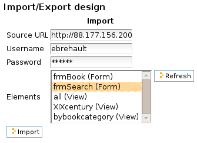

You can then choose the elements you want and click on **Import** to
import them into the local database.

In some cases (depending on firewalls, proxies, etc.), it is easier to
export from the local database to the remote one.

The principle is the same, you just need to use the **Export** section.


Replication
-----------

You can replicate documents between 2 Plomino databases, possibly on 2
different Zope servers. 

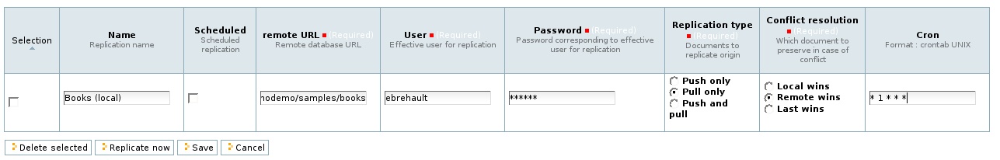

There are 3 replication modes:
- push mode: local modifications are replicated on the remote database;
- pull mode: remote modifications are replicated on the local database;
- push-pull mode: both.

If a document has been modified in both the local and remote databases
since the last replication, there are 3 conflict resolution modes:
- local wins,
- remote wins,
- last modified wins.

Replication can be useful to synchronize information between 2 servers,
or for mobile workers who want to be able to work on a local replica.

Start page
----------

By default, the database default screen is the generic database menu:

.. image:: images/m26047b00.png

But you might prefer to display something else instead (for instance a
view, a page, a search form, etc.).

In this case, go to your database **Edit** tab, and enter the element id
in the **Start page** parameter.

Agents
======

It might be useful to launch the same processing from different places
in the application (views action, forms action). To avoid duplicate=ing
the code, you can implement the code in an *agent*.

Select ``Plomino: agent`` in the **Add item** Plone menu, and enter an
identifier, a title and the code.

If needed, you can provide the id of a user that will be used to run the
agent (so the access rights of that user are applied when the agent is
executed, not those of the current user).

This might be useful to run archiving, cleaning, etc. without giving
manager rights to regular users.

The agent can be executed (from an action) using the `runAgent()` method::

    db=plominoDocument.getParentDatabase() 
    db.MyAgent.runAgent()

Note: this method can take `REQUEST` as parameter, which allows
variables in the querystring to be read and redirection to be performed.

If you install ZpCron on your Zope instance, an agent can also be
scheduled. You specify when the agent should run using a cron-like
format.

Resources
=========

A Plomino database contains a ``resources`` folder in the ZODB which can
contain useful extra assets:

- images or icons you may need to insert in your forms;

- CSS or javascript files;

- ZPT templates (see view template below);

- Python files, to provide a code library usable from the different
  formulas (using the `callScriptMethod` method);

- CSV (or other) files containing useful data;

- etc.

To access this folder, go to the **Design** tab, expand the **Others**
section and click on **Resources Folder**. It opens the standard ZMI
screen, which allows new elements to be added.


-----------------------
Plomino class reference
-----------------------

Non-exhaustive list of the classes' methods.

PlominoDatabase
===============

`callScriptMethod(self, scriptname, methodname, *args)`
    calls a method named methodname in a file named scriptname, stored in
    the ``resources`` folder. If the called method allows it, you may
    pass some arguments.

`createDocument(self)`
    returns a new empty document.

`deleteDocument(self, doc)`
    deletes the document

`deleteDocuments(self, doc)`
    batch delete documents from database. The `onDelete` formula and
    index updating are not performed (use `refreshDB` to update).

`getAgents(self)`
    returns all the PlominoAgent objects stored in the database.

`getAllDocuments(self)`
    returns catalog brains for all the PlominoDocument objects stored in
    the database.

`getCurrentUser(self)`
    returns the current user.

`getCurrentUserRights(self)` 
    returns the current user's access rights.

`getCurrentUserRoles(self)`
    returns the current user's roles.

`getDocument(self, docid)`
    returns the PlominoDocument object corresponding to the identifier.

`getForm(self, formname)`
    returns the PlominoForm object corresponding to the identifier.

`getForms(self)`
    returns all the PlominoForm objects stored in the database.

`getIndex(self)`
    returns the PlominoIndex object.

`getPortalGroups(self)`
    returns the Plone site groups.

`getPortalMembers(self)`
    returns the Plone site members.

`getPortalMembersIds(self)`
    returns the Plone site member ids.

`getPortalMembersGroupsIds(self)`
    returns the Plone site groups ids and all the Plone site members
    ids.

`getUserRoles(self)`
    returns all the roles declared in the database.

`getUsersForRight(self, right)`
    returns the users declared in the ACL and having the given right.

`getUsersForRoles(self,role)`
    returns the users declared in the ACL and having the given role.

`getView(self, viewname)`
    return the PlominoView object corresponding to the identifier.

`getViews(self)`
    returns all the PlominoView objects stored in the database.

`hasUserRole(self, user, role)`
    returns `True` if the specified user has the given role.

`isCurrentUserAuthor(self, doc)`
    returns `True` if the current user is author of the given document
    or has the PlominoAuthor right.

`refreshDB(self)`
    refresh the database index and the formulas.

PlominoDocument
===============

`delete(self, REQUEST=None)`
    deletes the document, and if ``REQUEST`` contains a key named
    ``returnurl``, uses its value to redirect the client.

`deleteAttachment(self,` `REQUEST)`
    remove file object and update corresponding item value.

`getfile(self, filename=None, REQUEST=None)`
    return the file corresponding to the given filename.

`getFilenames(self)`
    return the filenames of all the files stored with the document.

`getForm(self)`
    returns the form given by the *view form* formula (if the document
    is opened from a view and if the view has a form formula), else
    returns the form given by the document's Form item.

`getItem(self, name)`
    returns the item value if it exists, else returns an empty string.

`getItemClassname(self, name)`
    returns the class name of the item .

`getItems(self)`
    returns the names of all the items existing in the document.

`getParentDatabase(self)`
    returns the PlominoDatabase object which contains the document.

`getRenderedItem(self, itemname, form=None, convertattachments=False)`
    returns the item value using the rendering corresponding to the
    field type defined in the form (if form is `None`, it uses the form
    returned by `getForm()`). If `convertattachments` is `True`,
    FileAttachments items are converted to text (if possible).

`hasItem(self,` `name)`
    returns `True` if the item exists in the document.

`isAuthor(self)`
    returns `True` if the current user is author of the document or has
    the PlominoAuthor right.

`isEditMode(self)`
    returns `True` is the document is being edited, `False` if it is
    being read. Note the same method is available in PlominoForm, so it
    can be used transparently in any formula to know if the document is
    being edited or not.

`isNewDocument(self)`
    returns `False` (because an existing document is necessarily not
    new). Note the same method is available in PlominoForm (and returns
    `True`), so it can be used transparently in any formula to know if
    the document is being created or not.

`openWithForm(self,` `form,` `editmode=False)`
    display the document using the given form's layout (but first, check
    if the user has proper access rights).

`removeItem(self,` `name)`
    remove the item.

`save(self, form=None, creation=False, refresh_index=True)`
    refresh the computed fields and re-index the document in the Plomino
    index and in the Plone `portal_catalog` (only if `refresh_index` is
    `True`; `False` might be useful to improve the performance, but a
    `refreshDatabase` will be needed). It uses the field's formulas
    defined in the provided form (by default, it uses the form returned
    by `getForm()`).

`send(self, recipients, title, form=None)`
    send the document by mail to the recipients. The document is
    rendered in HTML using the provided form (by default it uses the
    form returned by `getForm()`).

`setItem(self,name,value)`
    set the value (if the item does not exist, it is created).

PlominoForm
===========

`getFormName(self)`
    returns the form id.

`getParentDatabase(self)`
    returns the PlominoDatabase object which contains the form.

`isEditMode(self)`
    returns `True`. 
    
    .. Note:: 
        the same method is available in PlominoDocument, so it can be
        used transparently in any formula to know if the document is
        being edit or not.

`isNewDocument(self)`
    returns `True` (when the context is a form, it is necessarily a new
    doc). 
    
    .. Note:: 
        the same method is available in PlominoDocument (and returns
        `False`), so it can be used transparently in any formula to know
        if the document is being created or not.

PlominoView
===========

`exportCSV(self, REQUEST=None)`
    returns the columns values in CSV format. If REQUEST is not `None`,
    download is proposed to the user.

`getAllDocuments(self)`
    returns all the documents which match the Selection Formula.
    Documents are sorted according the sort column (if defined).

`getDocumentsByKey(self, key)`
    returns all documents for which the value of the column used as sort
    key matches the given key.

`getParentDatabase(self)`
    returns the PlominoDatabase object which contains the view.

`getViewName(self)`
    returns the view id.

PlominoIndex
============

`dbsearch(self, request, sortindex, reverse=0)`
    searches the documents corresponding to the request (see ZCatalog
    reference). The returned objects are ZCatalog brains pointing to the
    documents (see ZCatalog reference).

`getKeyUniqueValues(self,` `key)`
    returns the list of distinct values for an indexed field.

`getParentDatabase(self)`
    returns the PlominoDatabase object which contains the index.

`refresh(self)`
    refresh the index.

PlominoUtils
============

.. Note::
    PlominoUtils is imported for any formula execution, its methods are
    always available (importing the module is not needed).

`DateRange(d1, d2)`
    returns the dates of all the days between the 2 dates.

`DateToString(d, format='%d/%m/%Y')`
    converts a date to a string.

`htmlencode(s)`
    replaces unicode characters with their corresponding html entities

`Now()`
    returns current date and time.

`PlominoTranslate(message, context, domain='CMFPlomino')`
    translate the given message using the Plone i18n engine (using the
    given domain).

`sendMail(db, recipients, title, html_message)`
    send a mail to the recipients.

`StringToDate(str_d, format='%d/%m/%Y')`
    converts a string to a date.

`userFullname(db, userid)`
    returns the user full name.

`userInfo(db, userid)`
    returns the Member object corresponding to the user id (it may be
    used to get the user email address for instance).

PlominoAgent
============

`getParentDatabase(self)`
    returns the PlominoDatabase object which contains the agent.

`runAgent(self, REQUEST=None)`
    runs the agent. If REQUEST is provided, there is a redirection to
    the database home page, unless the REQUEST contains a REDIRECT key
    If so, the formula returned value is used as the redirection URL.
