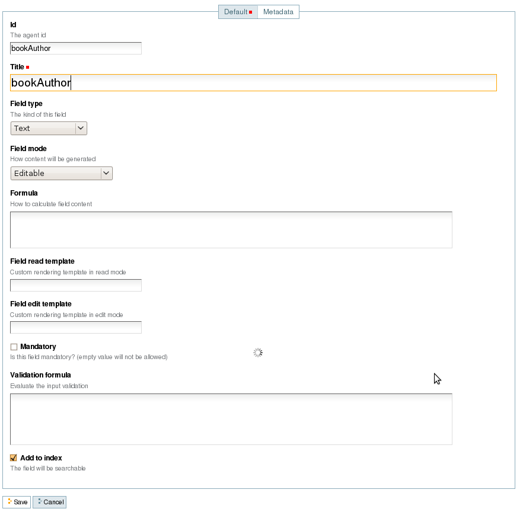
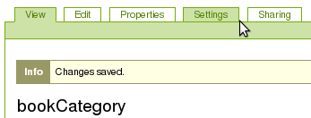
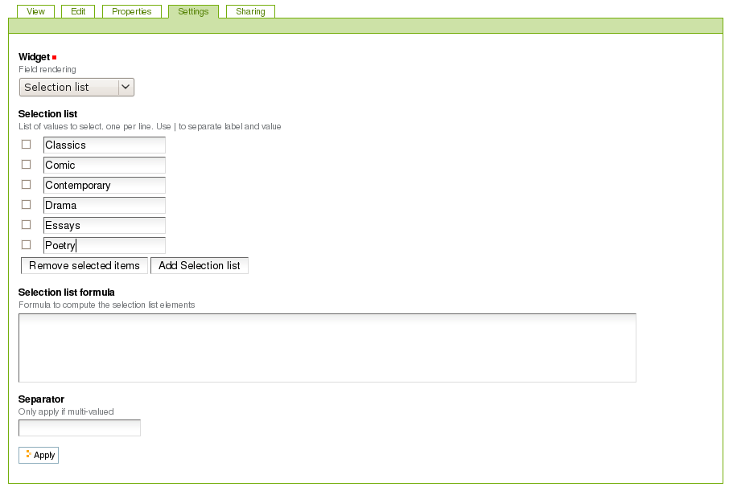
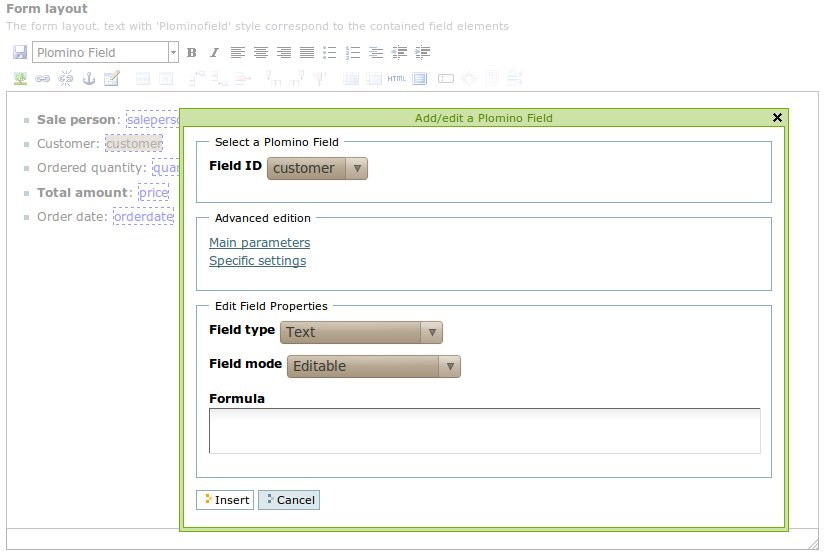
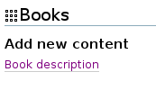
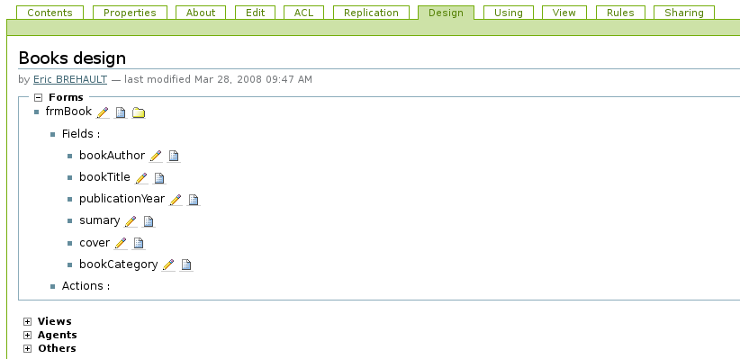

----------------------------------
Build a simple Plomino application
----------------------------------

Create a Plomino database
=========================

To create a Plomino database, select ``Plomino: database`` in the **Add item** Plone menu

.. image:: images/m440f207a.png

Enter a title for the database (for instance: Books) and save it.

Add a form
==========

To add a form, select ``Plomino: form`` in the **Add item** Plone menu.

.. image:: images/m4539359f.png

Enter the form id. The form id is initialized with a generated value
(for instance: ``plominoform.2008-01-31.9797530894``). It is preferable
to replace it with a more meaningful id (for instance: ``frmBook``). It
is a technical identifier, so use basic characters and numbers only
(blank space and special characters are forbidden).

In Title, enter the form label, which will be displayed to the users
(for instance: ``Book description``.

.. image:: images/m34f61fc7.png

Save.

Add fields
==========

To add a field, select ``Plomino: field`` in the Plone Add item menu. 

.. image:: images/2a0c5008.png

Like for Form, the id should be changed, and title must be completed.

Create a 'bookAuthor' field, with type 'Text', and check 'Add in index': 

and save.

Do the same for the following fields:

- 'bookTitle', type 'Text', Add in index 
- 'publicationYear', type 'Number', Add in index 
- 'summary', type 'Rich text', Add in index 
- 'cover', type 'File attachment' 
- 'bookCategory', type 'Selection list', Add in index

Once the bookCategory field saved, go its Settings tab. 

and enter in Selection list the possible values : 

Create the form layout
======================

Go back to the frmBook form object and click on the **Edit** tab.

In Form layout, you can create the layout you want using the Kupu
editor.

You indicate the area where a given field should be displayed by
entering its field id and applying the ``Plomino field`` style on it: 

.. image:: images/62293509.png 

The field will be displayed in Kupu in blue and dashed.

Save the modification.

Create fields and form at the same time using TinyMCE
=====================================================

** New in Plomino 1.5 **

If you use TinyMCE as your Plone richtext editor, you can install 
plomino.tinymce which plugs some Plomino specific features into 
the TinyMCE editor.

Use the form
============

Go back to the Books database, the database welcome page now contains a
link to add a new document using the ``Book description`` form:

Click on this link, and you get the form displayed as designed in the
kupu editor and including the fields as they have been defined: 

.. image:: images/3e84c372.png

You can enter values and save, it will create a new document: 

.. image:: images/m23140d98.png 

Explore the database design
===========================

Go to the Books database and click the **Design** tab.

This tab displays all the design elements contained in the database: 

The pencil icon gives access to the corresponding object in edit mode,
the page icon in read mode, and the folder icon in content mode.

Change the document title
=========================

As you can see on the document you have just created with the frmBook
form, the title is a meaningless identifier: 

To display a more meaningful title, go to the frmBook object, edit it,
go to **Parameters** tab, and enter the following formula in Document
title::

    "Information about "+plominoDocument.bookTitle +" ("+plominoDocument.bookAuthor+")"

Save the form, go back to the document, make a change and save it (so it
is refreshed), and you get the title as specified in the formula: 

.. image:: images/2dc31e82.png

'Document title' is computed by a formula. As all the entry points
allowing formula usage in Plomino, it is a Python expression where
``plominoDocument`` is the current document.

All the document items values are accessible as object attributes
(`plominoDocument.<field name>`).

For more information about formulas, see below.

Add a view
==========

Go back to the Books database.

Select ``Plomino: view`` in the **Add item** Plone menu. Enter an
identifier (``all``) and a title ('All the books'):

.. image:: images/m57ed2659.png

Enter a selection formula too: this formula must return `True` or
`False.` It is evaluated for each document, if the returned value is
`True`, the document is displayed in the view, if `False`, it is
rejected.

Enter the following expression::

    True

(this expression always return `True`, so all the documents will be
displayed).

Save.

You get the following result: 

.. image:: images/m64d1e0e7.png

We just see a link '**Go**' which allows us to access the document we
have created. Now we need to add columns to this view.

Add columns
===========

Select ``Plomino: column`` in the **Add item** Plone menu.

Enter an identifier and a title, and enter a formula to compute the
column value, for instance::

    plominoDocument.bookTitle

Then, enter the column position. 

.. image:: images/b38e0e1.png

Similarly, add a column to display bookAuthor.

If you go back to the Books database root, the view is proposed in the
Browse section: 

.. image:: images/m12df968f.png

Create more documents. When you click on the link 'All the books', the
view is displayed with its 2 columns (and its new documents): 

.. image:: images/6de65017.png

To improve browsing of the documents, it could be useful to sort the
view.

To do that, click on **Edit**, go to the **Sorting** tab and enter
``col1`` in the **Sorting** column, then save: 

.. image:: images/193e0720.png

Add more views
==============

You can add as many views as necessary.

You can build views able to filter the documents; for instance if you
enter the following selection formula::

    plominoDocument.publicationYear >=1800 and plominoDocument.publicationYear <1900

you will only list the XIXth century books.

You can create categorised views: create a view with a first column
which contains the `bookCategory` field value, and select
**Categorised** in the **Sorting** tab: 

.. image:: images/m233a2bba.png

Each category can be expanded or collapsed. 

Dynamic view
============

** New in Plomino 1.5 **

Click on **Edit**, go to the **Parameters**, and change widget to **Dynamic table**.
It renders the view using JQuery Datatables (column sorting, live filtering, ...).

Add a search form
=================

Create a new form named ``frmSearch``, and add some fields with the same
identifiers as the documents fields you want to be able to search; for
instance: bookTitle, bookAuthor and bookCategory.

In the **Parameters** tab, select 'Search form' and enter ``all`` in 'Search view': 

.. image:: images/22e7de63.png

This form is now proposed in the Search section in the Books database root: 

.. image:: images/197da1a1.png

If you click on this link, you get the search form, and if you enter
some criteria, the results are displayed under the form: 

.. image:: images/m54d2b2e2.png

.. Note:: 
    the criteria are effective only if the field names match the
    document item names.

``About`` and ``Using`` pages
=============================

Go to the Books database **Edit** tab. You can fill in the ``About this
database`` section and the ``Using this database`` section.

Information entered here will be available in the **About** and the
**Using** tabs. It allows you to offer users a page to describe the
purpose of the application and another one to give a short user guide.

