==================================
Build a simple Plomino application
==================================

Create a Plomino database
=========================

To create a Plomino database, select ``Plomino: database`` in the 
**Add item** Plone menu.

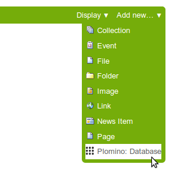

Enter a title for the database (for instance *Books*) and save it.

Add a form
==========

Forms can be added using the Plomino Design portlet, which is usually
displayed in the left-hand column, or using the Plone *Add* dropdown menu.

To add a form, click **Add new... Form** in the portlet, or select
``Plomino: form`` from the **Add item** Plone menu.

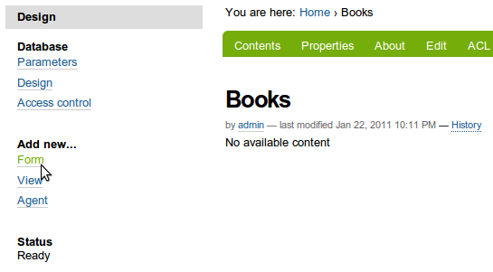

On the add form, enter the form id. The form id is initialized with a
generated value (for instance: ``plominoform.2008-01-31.9797530894``). It is
preferable to replace it with a more meaningful id (for instance:
``frmBook``). It is a technical identifier, so use basic characters and
numbers only (blank space and special characters are forbidden).

In the *Title* field, enter the form label, which will be displayed to the
users (for instance: ``Book description``.

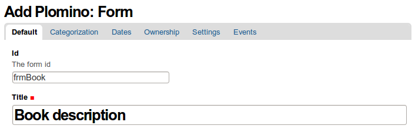

Save the form to create it (you need to save it before being able to add
fields to your form).

Create the layout and add fields
================================

Click on the **Edit** tab.

Go to the *Form layout* section which contains the TinyMCE editor. If
necessary, expand the editing area by dragging the bottom-right corner, or 
clicking on the full-screen icon from the editor toolbar.

Create your form layout using the standard editing tools (styles, tables,
etc.).

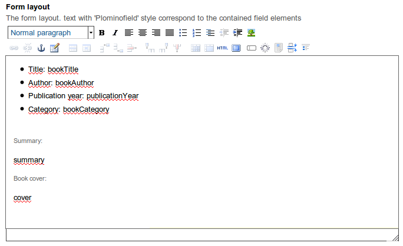

To add a field to the layout, select some word in the layout and click on
the *Add/edit Plomino field* button in the TinyMCE toolbar. 

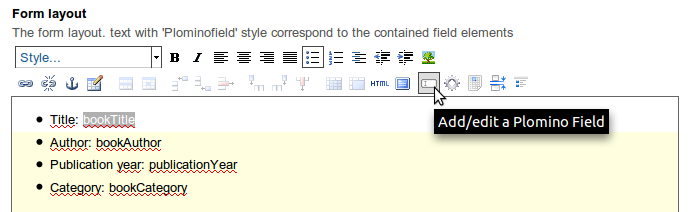

The selected text will be used as the field id, and a pop-up window will
allow you to enter the field main parameters:

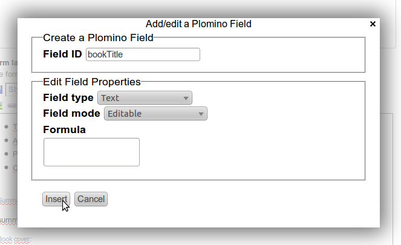

For the  ``bookAuthor`` field, keep the default values ('Text' and
'Editable'), click *Insert* and then *Close*.

As you can see, the field is rendered with a blue dashed border in the
layout.

Do the same for the following fields:

- ``bookTitle``, type 'Text', 'Editable' 
- ``publicationYear``, type 'Number', 'Editable' 
- ``summary``, type 'Rich text', 'Editable' 
- ``cover``, type 'File attachment', 'Editable'
- ``bookCategory``, choose type 'Selection list', 'Editable', but after
  clicking *Insert*, click on *Specific settings*.

This opens the field settings page in a new window, where you can enter the
possible values for the Selection list: 

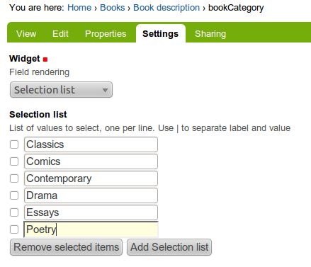

Click *Apply*, go back to the Form window, and close the field pop-up.

Now the form is built, and its associated fields have been created.

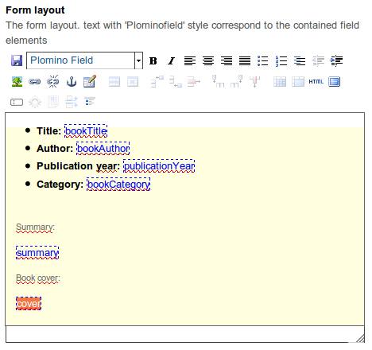

Save the form (click the *Save* button at the bottom of the page).

Use the form
============

You can now use this form to create documents.

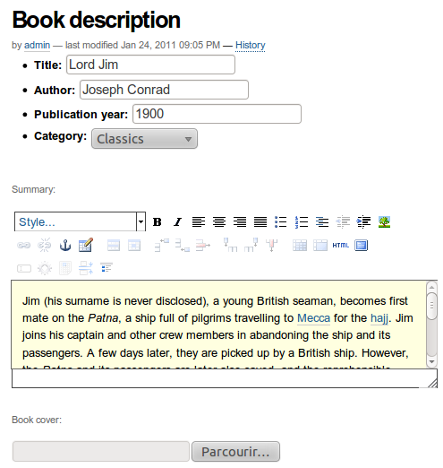

Go back to the *Books* database. The database welcome page now contains a
link to add a new document using the ``Book description`` form:

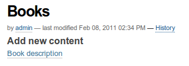

Click on this link, and you get the form displayed as designed in the
TinyMCE editor, including the fields as they have been defined: 

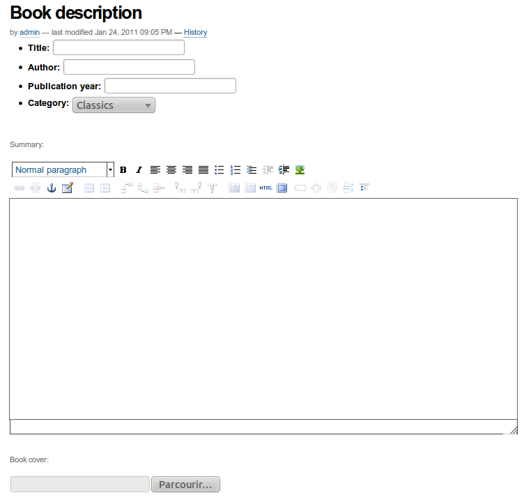

You can enter values and save, and a new document will be created: 

.. image:: images/build-9.png 

Explore the database design
===========================

Go to the *Books* database and click the *Design* tab.

This tab displays all the design elements contained in the database: 

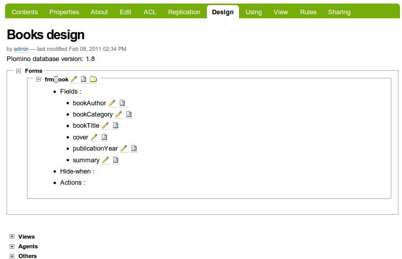

The pencil icon gives access to the corresponding object in edit mode,
the page icon in read mode, and the folder icon in content mode.

Change the document title
=========================

By default, all the documents created with a form have the same title as the
form. 

In the present case, the title is "Book description", and it will be the
title of all the documents you would create with your form.

To display a more useful title, go to the ``frmBook`` object, edit it, and
enter the following formula in the *Document title formula* field::

    return "Information about %s (%s)" % (
        plominoDocument.getItem('bookTitle'), 
        plominoDocument.getItem('bookAuthor'))

Save the form, go back to the document, make a change and save it. This
will trigger calculation of the title formula. Now you will see the title
has been set as specified in the formula: 

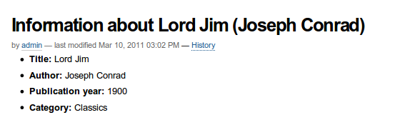

The document title is computed by a formula. All Plomino formulas are 
restricted Python scripts with certain variables and functions provided.
In this case, the ``plominoDocument`` variable is used, which is the current
document.

All the data items stored on the document by forms, or set using formulas, 
are accessible using the ``getItem`` API: 
(``plominoDocument.getItem(<field name>)``).

For more information about formulas, see Formulas_ below.

.. _Formulas: ./features.html#Formulas

Change the document id
======================

The document id is used in the URL. By default, it is an opaque random
identifier (``4e219e4ffff21b9753c94a0e006e95bf`` in the following)::

    http://localhost:8090/demo/books/plomino_documents/4e219e4ffff21b9753c94a0e006e95bf

If you want to use meaningful ids, you can define a *Document id formula*.
Go to the ``frmBook`` object, edit it, and enter the following formula in
'Document id formula'::

    plominoDocument.bookTitle +"-"+plominoDocument.bookAuthor

Unlike the title, the id is computed at creation time, and it cannot be
changed later.  So the existing document will not use this formula even if
we re-save it.  But if you create a new document, you will get a id
corresponding to your formula::

    http://localhost:8090/demo/books/plomino_documents/1919-john-dospassos

.. Note: If you use this facility, you need to take care that document
   ids are unique, well-formed, and resolve any issues that arise when 
   replicating documents to other Plomino instances. Calculating your 
   own document ids can be a considerable responsibility, depending on the
   requirements of your application.

Add a view
==========

A view defines a collection of documents. Some views are used to present
list of documents to users, and some are used from formulas to structure the
Plomino application. 

A view has a selection formula, which defines which documents form part of
the view, and it usually contains some columns to display information about
the matching documents. These columns may compute derived information from
data items on documents, or even from values looked up from other documents,
Plone objects, or other sources. 

You can generate a view automatically from a form:

- Go to the ``frmBook`` form, and 
- click on *Generate view* in the Design portlet on the left.

This generates a view which:

- selects all the documents that were created or last edited using the
``frmBook`` form,
- creates a column for each field on the form (file attachments and rich
  text fields are skipped), and it also 
- inserts an *Add new* action.

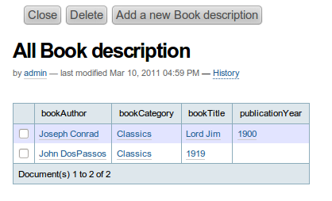

The columns can be re-ordered by drag-and-drop in the *Contents* tab. The
column labels can also be changed.

Add a view manually
===================

Go back to the Books database.

Select ``Plomino: view`` from the *Add item* Plone menu. Enter an
identifier (``allBooks``) and a title ('All the books'):

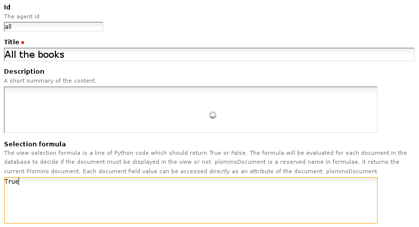

Enter a selection formula too: this formula must return ``True`` or
``False``. It is evaluated for each document; if the returned value is
``True``, the document is included in the view; if ``False``, it is
rejected.

Enter the following expression::

    True

(this expression always return ``True``, so all the documents will be
displayed).

Save.

You get the following result: 

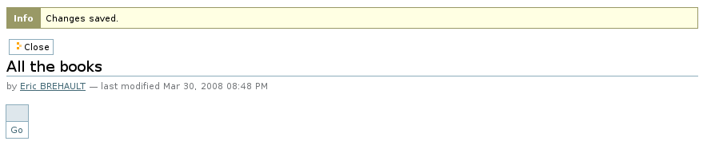

We just see a link '*Go*' which allows us to access the document we
have created. Now we need to add columns to this view.

Select ``Plomino: column`` from the *Add item* Plone menu.

Enter an identifier and a title, and enter a formula to compute the
column value, for instance::

    return plominoDocument.getItem('bookTitle')

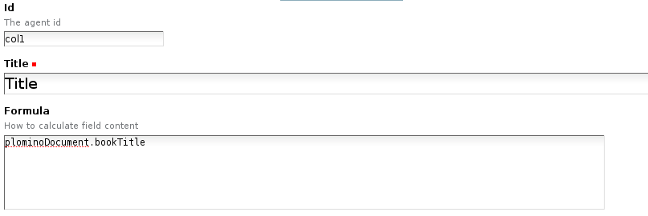

Similarly, add a column to display ``bookAuthor``.

Columns can be ordered by going to the view's *Contents* tab and moving the
columns where needed.

If you go back to the Books database root, the view is proposed in the
*Browse* section: 

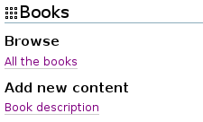

Create more documents. When you click on the link *All the books*, the
view is displayed with its 2 columns (and its new documents): 

.. image:: images/6de65017.png

To improve browsing of the documents, it could be useful to sort the
view.

To do that, click on *Edit*, go to the *Sorting* tab and enter
``col1`` in the *Sorting* column, then save: 

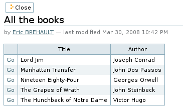

Add more views
==============

You can add as many views as necessary.

You can build views able to filter the documents; for instance if you
enter the following selection formula::

    return (plominoDocument.getItem('publicationYear') >= 1800 and 
        plominoDocument.getItem('publicationYear') < 1900)

you will only list the XIXth century books.

You can create categorised views: create a view with a first column
which contains the ``bookCategory`` field value, and select *Categorised*
in the *Sorting* tab: 

.. image:: images/m233a2bba.png

Each category can be expanded or collapsed. 

Dynamic view
============

Click on **Edit**, go to the **Parameters**, and change widget to **Dynamic table**.
It renders the view using JQuery Datatables (column sorting, live filtering, ...).

Add a search form
=================

Create a new form named ``frmSearch``, and add some fields with the same
identifiers as the documents fields you want to be able to search; for
instance: bookTitle, bookAuthor and bookCategory.

In the **Parameters** tab, select 'Search form' and enter ``all`` in 'Search view': 

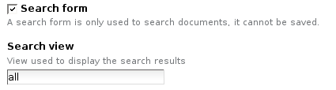

This form is now proposed in the Search section in the Books database root: 

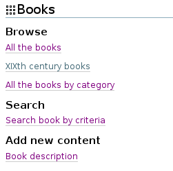

If you click on this link, you get the search form, and if you enter
some criteria, the results are displayed under the form: 

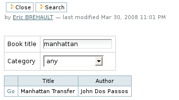

.. Note:: 
    the criteria are effective only if the field names match the
    document item names.

``About`` and ``Using`` pages
=============================

Go to the Books database **Edit** tab. You can fill in the ``About this
database`` section and the ``Using this database`` section.

Information entered here will be available in the **About** and the
**Using** tabs. It allows you to offer users a page to describe the
purpose of the application and another one to give a short user guide.

