------------------
Features reference
------------------

Formulas
========

Formulas are Python expressions.

If it is a one line expression, the returned value corresponds to the
Python expression evaluation. Example::

    plominoDocument.price*15

return the value ``price`` multiplied by 15.

But if the expression consists of several lines, you must use ``return``
to specify the value to return. Example::

    total_price=plominoDocument.purchasePrice + plominoDocument.productionCosts 
    taxes=total_price*0,196 
    return taxes

And if you just write::

    total_price=plominoDocument.purchasePrice + plominoDocument.productionCosts
    total_price*0,196

no value would be returned.

.. Note::
    a formula is not necessarily required to return a value -- you may
    just need to make some changes in some documents (for instance if it
    is the formula in a Plomino action), so the return value would be
    irrelevant.

``plominoDocument`` is a reserved keyword which corresponds to the
current document on which the formula is evaluated.

You can use ``plominoContext`` as a synonym of ``plominoDocument``,
because in some cases the formula is executed on an object which is not
a Plomino document (but a view, or a form, for instance).In those cases,
``plominoContext`` will be prefered to avoird confusion.

The document items can be accessed as if they were attributes, or using
the `getItem()` method: ``plominoDocument.validationDate`` is equivalent to: 
``plominoDocument.getItem('validationDate')``. 

.. Note:: 
    there is still a small difference, because if an item does not
    exist, the attribute notation will produce an error, whereas
    `getItem` will return an empty string ``''``.

To change an item value, use the `setItem()` method: 
``plominoDocument.setItem('firstname', 'Eric')``

You can access the parent Plomino database of the document (or view, or
form, according the context) using the `getParentDatabase()` method.

You can also access the views and the other documents. Example::

    db=plominoDocument.getParentDatabase() 
    view=db.getView('pendingPurchases') 
    total=0 
    for doc in view.getAllDocuments(): 
        total=total+doc.price 
    return total

(this example computes the total amount for the pending purchase requests).

You can check the current user rights or roles. Example::

    db=plominoDocument.getParentDatabase() 
    user=db.getCurrentUser() 
    if db.hasUserRole(user.id, '[Expert]'): 
        return True 
    elif db.isCurrentUserAuthor(doc): 
        return True 
    elif 'PlominoEditor' in db.getCurrentUserRights(): 
        return True 
    else: 
        return False

You can change the author access rights on a given document by modifying
its `Plomino_Authors` item.

This item is created automatically for any document and contains the
user id of the document creator. If you want your document to be
editable by users other than its creator, it can contain other ids as
well. Example::

    authors=plominoDocument.getItem('Plomino_Authors') 
    authors.append('[Expert]') 
    if not 'inewton' in authors: 
        authors.append('inewton') 
    plominoDocument.setItem('Plomino_Authors', authors)

As you can see in this example, you can add user ids and/or user roles.

For a better understanding of the methods available on Plomino objects,
see below in this document.

Actions
=======

By default, Plomino offers few standard actions (**Exit**, **Save**,
**Delete**, **Edit**, etc.) depending on the object type (document,
view, form), on the current mode (read mode or edit mode), and on the
user access rights.

To improve the application usability, you may need to add more actions
in the forms or in the views.

To create an action, select ``Plomino: action`` in the **Add item**
Plone menu.

.. image:: images/6cee3f7f.png

Enter an identifier and a title.

Then select the action type:

- Open form: open the form indicated by the ``Parameter or code``
  parameter to create a new document.

- Open view: open the view indicated by the ``Parameter or code``
  parameter.

- Close: go back to the database home page.

- Save: submit the form with its current content, and save (or create)
  the document.

- Python script: run the formula entered in ``Parameter or code``, and
  redirect to the current object (in read mode). Examples: send a mail
  notification to someone, compute a field value and update the document
  with this new value, etc.

- Redirect: same as ``Python script``, but the formula should return an
  URL that will be used for redirection. Example: create a new document
  using some values from the current document, and automatically open
  this new document.

You can add a *hide-when* formula to control when the action should be
visible or not.

If you select ``Display action in action bar``, the action will be
displayed together with the standard Plomino actions in the action bar.

** New in Plomino 1.5 **

Actions can be inserted directly in the form layout using TinyMCE.

Example:

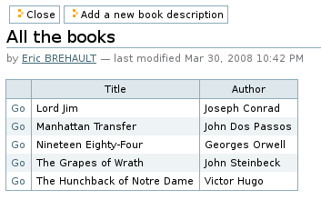

But (in forms only) you can also choose to insert the action within the
form layout directly. You must use the *Plomino action* style in Kupu,
and the action will be rendered according the Action display parameter
(link, submit button, or button).

Example:

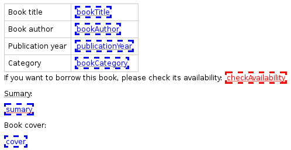

Result:

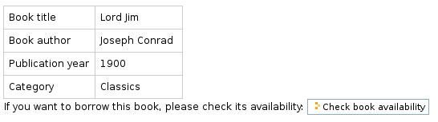


Fields
======

Computed fields
---------------

In a form, the fields where the user can enter data are in *edit* mode.

You might also need to use fields which can not be changed by the user.
Here are the other modes offered in Plomino:

Computed
    the field value is computed with a formula each time the document is
    opened, and it is saved each time the document is saved.

Computed on creation
    the field value is computed only once, the first time the document
    is saved.

Computed for display
    the field value is computed each time the document is opened, but it
    is not saved.

Example: create a computed for display field with this formula::

    category=plominoDocument.bookCategory 
    result="" 
    if not category=='': 
        index=plominoDocument.getParentDatabase().getIndex() 
        autres=index.dbsearch({'bookCategory': category}, None) 
        result="There are "+str(len(autres)-1)+" other books in the same category" 
    return result

and insert it in the frmBook form: 

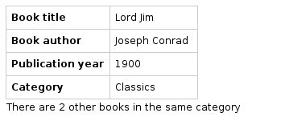


Validation
----------

By default, Plomino validates fields according to their type (for
instance, letters are not allowed in a Number field).

You can also add more validation criteria in the field's **Validation**
tab:

- a field can be mandatory: if the field is empty when the document is
  saved, Plomino does not save the document and displays an alert to the
  user.

- you can enter a formula to implement a specific validation rule (which
  may depend on other fields values).

For instance, in a *Purchase request* application, the maximum
authorised amount is 1000 euros. You would enter the following formula
in the TotalAmount field::

    if plominoDocument.TotalAmount>1000: 
        return 'The total amount must be under 1000 euros` 
    else: 
        return '`

Note: the formula must return an empty string if validation succeeds or
an error message if it is not.

Doclinks
--------

A Doclink field allows a Plomino document to reference another document.

The doclink stores the path to the targeted document, and it is
displayed as a link.

You may use a *view* as the source of possible targeted documents.

Example
```````

We have a Contact form allowing users to enter contact information about
company employees.

The view ``allcontacts`` returns all the contact documents:

.. image:: images/m55c9e282.png

We add a doclink field, named ``manager``, in the Contact form to enter
the corresponding manager of each employee.

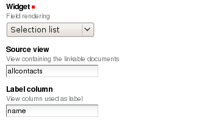

It uses the ``allcontacts`` view as its document list source, and
displays the ``name`` column value as label:

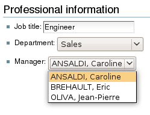

In read mode, the field displays a link to the corresponding document:

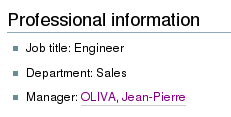

If you choose the ``Embedded view`` widget, the field displays the view
itself (including all columns), with a checkbox to select documents:

.. image:: images/m2eb3ebc9.png

Instead of using a view, you can compute the document list using a
formula (which will override the Embedded view widget), so you can
filter the documents you want to list, you can retrieve documents from
another database, or even list Plone objects which are not Plomino
documents. For example::

    contactsdb=plominoDocument.restrictedTraverse("/Plone/demo/contacts") 
    view=contactsdb.getView('allcontacts') 
    return [d.lastname+"|"+d.getPath() for d in view.getAllDocuments()] 

.. Note::
    in this example, we use the `getAllDocuments` method to get the
    documents list, this method returns Catalog brains

    To improve performance, the ``lastname`` field has been added to the
    index, so there is no need to wake up the objects (using
    `getObject`), and we use the `getPath` method to get the path of the
    real object.
    
.. Todo: 
    Hmm, getAllDocuments doesn't sound like it will return brains, it
    sounds like it will return documents. Looking at the source code, I
    see that it does in fact return documents (``d.getObject() for d in
    res``) so this must have changed since 1.3. 

Field templates
---------------

You can create a custom template to render a field in a different way
than the regular field widgets.

The field template must be added in the Resources folder in the ZMI (go
to **Design tab/Others/Resources folder**) as a Page Template.

To be applied, the template id must be then entered in the *Field read
template* or in the *Field edit template*.

The template code can be copied from the Plomino products sources
(`CMFPlomino/skins/cmfplomino_templates/**FieldEdit.pt` or
`**FieldRead.pt`).

Here is an example showing a multi-categorized tag field:

Edit template::

    <span tal:define="
        field options/field;
        db options/field/getParentDatabase;
        categories python:
            [doc.getObject() for doc in db.getView('tags').getAllDocuments()]
        ">
    <table><tr>
    <tal:loop repeat="cat categories">
        <td valign="top" tal:define="
            c cat/tagCategory;
            tags cat/tagList
            ">
        <span tal:content="c">category</span>
        <select tal:attributes="name options/fieldname"
            multiple="true"
            lines="4">
        <tal:block repeat="v python:
            [t+'|'+c+':'+t for t in tags.split(',')]
            ">
            <tal:block define="
                current options/fieldvalue;
                l python:v.split('|')
                ">
                <option tal:attributes="
                    value python:l[1];
                    selected python:test(current and l[1] in current,1,0)
                    "
                    tal:content="python:l[0]">value</option>
            </tal:block>
        </tal:block>
        </select>
        </td>
    </tal:loop>
    </tr>
    </table>
    </span>

Result:

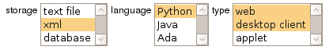

Read template::

    <tal:block tal:repeat="v options/selection">
        <tal:block define="
            current options/fieldvalue;
            l python:v.split('|')
            ">
            <tal:block condition="
                python:test(current and l[1] in current,1,0)">
                <tal:block define="
                    v python:l[0];
                    cat python:v.split(':')[0];
                    t python:v.split(':')[1]
                    ">
            <br/><span class="discreet" tal:content="cat">category</span>
            <span class="callout" tal:content="t">category</span>
                </tal:block>
            </tal:block>
        </tal:block>
    </tal:block>

Result:

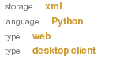


Forms
=====

Events
------

In a Plomino form, you can use the following events:

`onOpenDocument`
    executed before document is opened (in both read mode and edit mode)

    If the formula for this event returns a false value, opening is
    allowed; but if it returns a true value, e.g. a string,
    opening fails, and the value is displayed as an error
    message.

`onSaveDocument`
    executed before document is saved

`onDeleteDocument`
    executed before document is deleted

`onCreateDocument`
    executed before the document is saved for the first time
    (`onSaveDocument` will also be executed, but after
    `onCreateDocument`)

`beforeCreateDocument`
    executed before a blank form is opened.
    
In the **Events** tab, you can enter the formulas for each event you
need.

Example: enter the following formula for the `onSaveDocument` event::

    date=DateToString(DateTime()) 
    db=plominoDocument.getParentDatabase() 
    user=userFullname(db, db.getCurrentUser()) 
    plominoDocument.setItem(
        'history',
        plominoDocument.getItem('history') +
        "This document has been modified by "+user+" on "+date)

it will update the ``history`` item which logs all the modifications,
authors and dates.

Hide-when formulas
------------------

In a form, it might be useful to hide or display some sections according
different criteria (an item value, the current date, the current user's
access rights, etc.).

To do so, you must use Hide-when formulas.

Select ``Plomino: hide when`` in the **Add item** Plone menu.

Enter an identifier, a title, and a formula. Example:
``plominoDocument.bookState=='Damaged```

Then, modify the form layout to insert the hide-when formula in the form
layout. Enter the following: ``start:hide-when-identifier``
at the beginning of the area to hide. And the following at the end:
``end:hide-when-identifier``
And apply the Plomino *Hide-when* formula style to those 2 bounds:

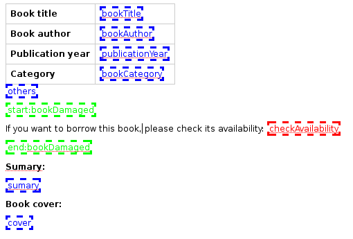

If the hide-when formula returns `True`, the enclosed area will be
hidden. If it returns `False`, the area is displayed (in our example: if
the book is damaged, it cannot be borrowed, so we hide the action to
check the book availability).

** New in Plomino 1.5 **

Hide-when formulas can be inserted directly in the form layout using TinyMCE.

Sub-forms
---------

An application can contain several forms.

In the Book library example, we could add a CD form and a Video form.
Those 2 forms would probably have several similar fields (availability,
last borrower, return date, etc.).

To avoid having to build (and maintain) the same things several times,
you can use sub-forms.

The sub-form principle is to insert a form within another form.

In our example, we create a ``borrowInfo`` form containing the
borrower name, the return date, and the availability, and we insert it
as a sub-form in ``frmBook``, ``frmCD`` and ``frmVideo``.

The form is inserted using the Plomino *Subform* style in Kupu:

.. image:: images/m12bfc6b1.png

.. Note:: 
    as you probably do not want 'borrowInfo' to be displayed in the
    database home page, you have to check ``Hide in menu`` in the form
    **Parameters** tab.

** New in Plomino 1.5 **

Sub-forms can be inserted directly in the form layout using TinyMCE.

Search formula
--------------

When you create a search form, Plomino uses the form fields to make a
regular ZCatalog search among the view's documents.

If needed, you can create a specific search formula in the form
**Parameters** tab.

This formula must return `True` or `False` for each document listed in
the search view.

You can access the values submitted by the search form on the REQUEST
object: `plominoContext.REQUEST.get('myfield')`.

Example::

    period=plominoContext.REQUEST.get('period') 
    if period=='Ancien regime': 
        return plominoDocument.year 
    if period=='Empire': 
        return plominoDocument.year >=1804 and plominoDocument.year

.. Note::
    Search formulas can be a lot slower than regular ZCatalog searches,
    you must use them carefully.

Page
----

Like a Search form, a Page form cannot be used to save documents;
moreover Page forms do not display any action bar.

Nevertheless, like any form, it can contain computed fields, actions
(inserted in the form layout), or hide-when formulas, so it is a good
way to build navigation pages, custom menus, or information pages (like
reports, etc.).

Example:

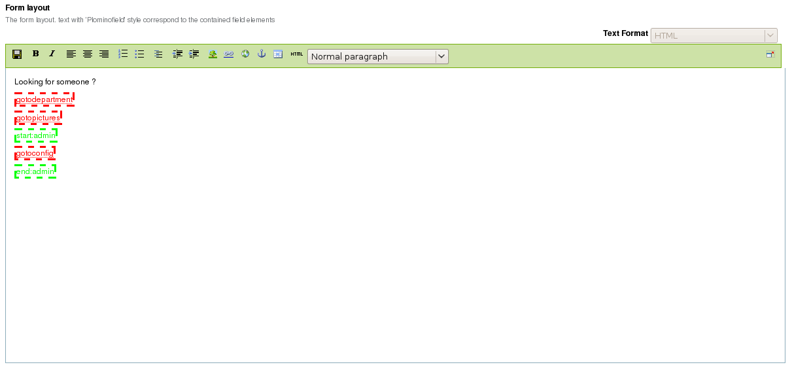

Here we create a page with 3 actions to access 3 different views, but
the last one is enclosed in a Hide-when formula so it will not be
displayed if the current user does not satisfy a given criteria. In the
example, we test if the user has the ``[dbadmin]`` role::

    "[dbadmin]" not in plominoContext.getCurrentUserRoles()

Result if you are not ``[dbadmin]``:

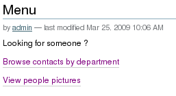

Result if you are ``[dbadmin]``:

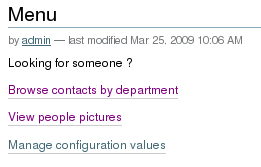


Views
=====

Form formula
------------

You may need to read or edit documents with different forms.

For instance, a person who wants to borrow a book wants different
information (book description, category, publication year, etc.) than
the librarian (who may want last borrower, return date, availability,
etc.).

As explained previously, we can manage this issue using hide-when
formulas, actions and sub-forms.

But if the functional differences are too great, or if the layout is
totally different, those strategies will probably produce too much
complexity.

In such a case, it is better to create a totally different form (named
``frmBorrowManagement`` for instance).

Unfortunately, the document always opens with the form used the last
time it has been saved.

To open the document with a different form, you need to create a
specific view for borrow management and use the Form formula parameter.

This formula will compute the name of the form to use when the documents
are opened from the view.

If you enter ``frmBorrowManagement`` in Form formula, all the documents
opened from this view will be displayed using the `frmBorrowManagement`
form.

View template
-------------

If you need a specific layout for a view, you can create a ZPT page
which can be used instead the default template.

This way, you can build calendar view, Gantt view, produce charts, etc.

To do so, add your Page Template in the resources folder, and enter its
name in View Template in the view Parameters tab.

A good approach is to copy the ZPT code from
`CMFPlomino/skins/CMFPlomino/OpenView.pt` (in the Plomino sources) and
append your modifications.

.. Note:: good knowledge of ZPT is required.

Export CSV
----------

All the views can be exported as CSV. The export contains the value of
each column.

Go to the database **Design** tab, expand the **Views** section and
click the green arrow icon next to the view you want to export.

You can build views specifically for export purposes, you just need to
create the columns according the values you want to get in CSV (note: if
you do not want this view to be offered on the database home page, check
``Hide in menu`` in the view **Parameters** tab).

Database
========

Refresh a database
------------------

After copy/paste of views or forms, or deletion of fields, a Plomino
database may be corrupted.

If so, you have to refresh the database. This will re-build the database
index entirely, and destroy all the previously compiled Plomino formula
scripts (the first time a formula is called, it is compiled in a Python
Script object in the ZODB).

To do so, go to the database **Design** tab, expand the **Others**
section and click on **Database refresh**.

Refresh also migrates your database to your current Plomino version (if
Plomino has been upgraded since the database was created).

Design import/export
--------------------

You can export or import Plomino database design elements from one Zope
instance to another.

This may be useful if you want to deploy a new application from a
development server to a production server, or if you want to release a
modification or a correction on an application already in production.

To import design elements, go to the database **Design** tab, and in the
**Import/Export Design** section, fill in the following parameters:

- the URL of the Plomino database which contains the elements you want
  to import in the current database;

- user id and password corresponding to a user account on the remote
  instance. This account must be PlominoManager on the remote Plomino
  database.

Then click on refresh: Plomino will load the list of all the available
elements in the remote database.

.. image:: images/790674a2.png

You can then choose the elements you want and click on **Import** to
import them into the local database.

In some cases (depending on firewalls, proxies, etc.), it is easier to
export from the local database to the remote one.

The principle is the same, you just need to use the **Export** section.


Replication
-----------

You can replicate documents between 2 Plomino databases, possibly on 2
different Zope servers. 

.. image:: images/45edb683.png

There are 3 replication modes:
- push mode: local modifications are replicated on the remote database;
- pull mode: remote modifications are replicated on the local database;
- push-pull mode: both.

If a document has been modified in both the local and remote databases
since the last replication, there are 3 conflict resolution modes:
- local wins,
- remote wins,
- last modified wins.

Replication can be useful to synchronize information between 2 servers,
or for mobile workers who want to be able to work on a local replica.

Documents XML import/export
---------------------------

In the Replication tab (at the bottom), you can import/export documents
from/to an XML file.

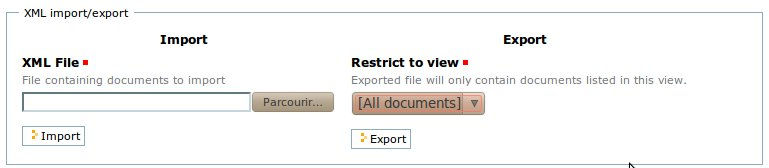

Exported documents can be restricted to a view (meanning that only documents
selected in this view will be exported).

Document ids are preserved so if a document already exists in the target
database, it is updated and not duplicated.

Note: when importing from XML, onSaveDocument event is not called (as document
items are all part of the export).

Documents CSV import
--------------------

In the Replication tab, you can import documents from a CSV file.

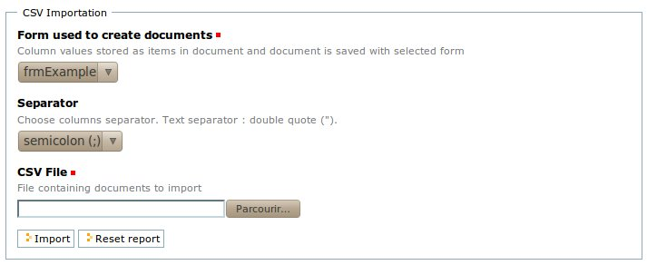

You need to indicate which form has to be used to create the documents.

The first row in the CSV file must contain the field id for the considered
column.

Note: when importing from CSV, onSaveDocument event is called (as some
items might needed to be computed) but index is not refreshed to avoid
bad performances.

Start page
----------

By default, the database default screen is the generic database menu:

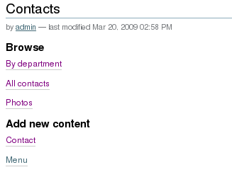

But you might prefer to display something else instead (for instance a
view, a page, a search form, etc.).

In this case, go to your database **Edit** tab, and enter the element id
in the **Start page** parameter.

Agents
======

It might be useful to launch the same processing from different places
in the application (views action, forms action). To avoid duplicate=ing
the code, you can implement the code in an *agent*.

Select ``Plomino: agent`` in the **Add item** Plone menu, and enter an
identifier, a title and the code.

If needed, you can provide the id of a user that will be used to run the
agent (so the access rights of that user are applied when the agent is
executed, not those of the current user).

This might be useful to run archiving, cleaning, etc. without giving
manager rights to regular users.

The agent can be executed (from an action) using the `runAgent()` method::

    db=plominoDocument.getParentDatabase() 
    db.MyAgent.runAgent()

Note: this method can take `REQUEST` as parameter, which allows
variables in the querystring to be read and redirection to be performed.

If you install ZpCron on your Zope instance, an agent can also be
scheduled. You specify when the agent should run using a cron-like
format.

Resources
=========

A Plomino database contains a ``resources`` folder in the ZODB which can
contain useful extra assets:

- images or icons you may need to insert in your forms;

- CSS or javascript files;

- ZPT templates (see view template below);

- Python files, to provide a code library usable from the different
  formulas (using the `callScriptMethod` method);

- CSV (or other) files containing useful data;

- etc.

To access this folder, go to the **Design** tab, expand the **Others**
section and click on **Resources Folder**. It opens the standard ZMI
screen, which allows new elements to be added.

