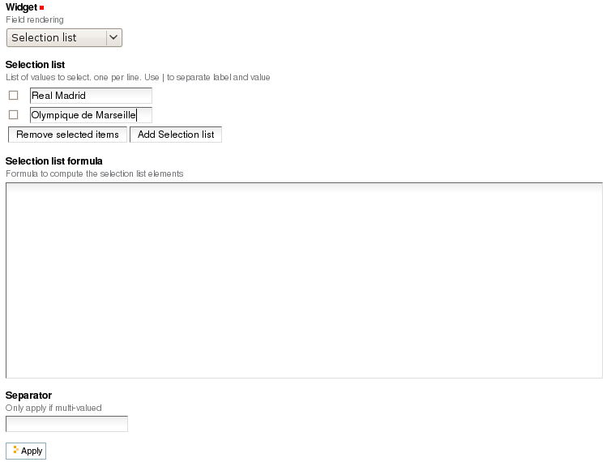
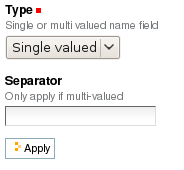
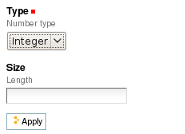
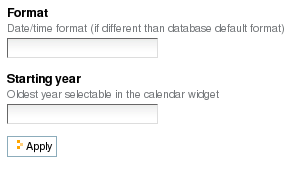
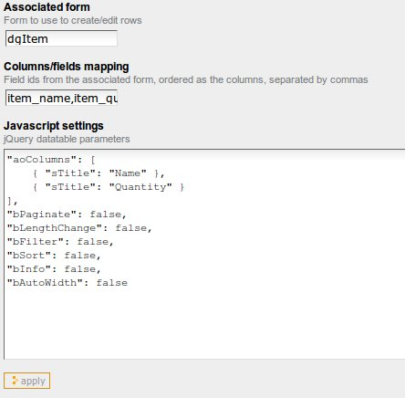
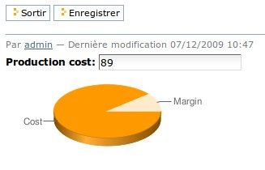
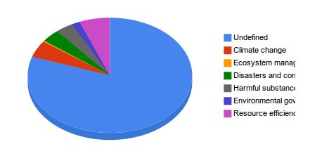
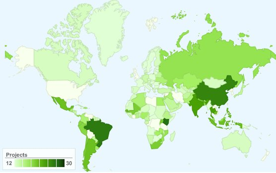

----------------
Fields reference
----------------

General parameters
==================

id
    :Value:
        Free text. 
        
        It mustn't contain special characters or spaces.
    :Purpose:
        Field identifier. It is used in Plomino formulas to identify the
        corresponding document item.                                                                   
Field type
    :Value:
        - Selection list 
        - Name 
        - Text 
        - Number 
        - Date/Time 
        - File attachment 
        - Rich text 
        - Doclink                                
    :Purpose:
        Depending on the field type, the values entered in the field
        and/or the rendering of the field might be different. (See
        Type-specific parameters.)
Field mode
    :Value:
        - Editable 
        - Computed 
        - Computed for display 
        - Computed on creation
    :Purpose:
        When editable, a field value can be entered by the user.
        Otherwise, its value is computed using a formula. See Advanced
        features -- Computed field.
Formula
    :Value:
        Python code
    :Purpose:
        Depending on the field mode, this formula will compute the field
        value (if computed), or just its default initial value (if
        editable).
Field read template and field edit template
    :Value:
        .PT template id
    :Purpose:
        The custom .pt template to use to render the field. See Advanced
        features -- Field template.
Validation formula
    :Value:
        Python code
    :Purpose:
        The validation formula must return a string containing the error
        message if the validation failed, or an empty string is the
        validation was successful.
Add to index
    :Value:
        True/False
    :Purpose:
        If `True`, the field is added to the database index, allowing to
        perform search on its values.


Type-specific parameters
========================

Type-specific parameters are available in the field's Settings tab:

.. image:: images/7ef734a8.png

Text field
----------

.. image:: images/3fdf9792.png

Widget
    :Value:
        - ``Text``      
        - ``Long text`` 
    :Purpose: Text is rendered as a basic HTML input text field.
Size
    :Value: Integer       
    :Purpose: 
        - If Text widget: input text size.
        - If Long text: textarea rows.



Selection list field
--------------------

Widget
    :Value: - ``Selection list``
            - ``Multi selection list``
            - ``Checkboxes``
            - ``Radio buttons``
    :Purpose: Note: multi selection list and checkboxes are multi-valued.
Selection list 
    :Value: List of strings
    :Purpose:
        The possible values selectable in the field.

        Note: if a value contains a pipe (`|`), Plomino uses the string
        *before* the pipe as the entry label, and the string *after* as the
        real value. 

        Example: ```United states of America|USA```
Selection list formula 
    :Value: Python script
    :Purpose: 
        The formula must return the list of values selectable in the
        field (using the ```label|value``` format if necessary).

        Note: if a Selection list formula is provided, it overrides the
        Selection list to provide the field value list.
Separator 
    :Value: String
    :Purpose: 
        Used to separate the values in read mode for multi-valued fields
        and also in edit mode for radio buttons and checkboxes.

        Default is blank.

        Examples: ``;-,``


Name field
----------



Type
    :Value: 
        - ``Single valued``
        - ``Multi valued``
Separator
    :Value: String
    :Purpose:
          Used to separate the values in read mode.

          Default is blank.

          Examples: ``;-,``


Number field
------------



Type
    :Value:
        - ``Integer``
        - ``Float``
Size
    :Value:
        Integer
    :Purpose:
        Length of the HTML input.


Date/Time field
---------------



Format
    :Value:
          Python date pattern
    :Purpose:
          Example: `%d/%m/%Y`

          If empty, default to the Database default date format.
Starting year
    :Value:
          Integer
    :Purpose:
          Earliest year selectable using the date/time widget.

          If empty, default to the Plone site default starting year.


File attachment field
---------------------

No specific parameters.

Rich text field
---------------

No specific parameters.

Doclink field
-------------

.. image:: images/m78a38b08.png

Widget
    :Value:
        - ``Selection list``
        - ``Multi-selection list``
        - ``Embedded view``
    :Purpose:
          If *Embedded view* is selected, the view itself is displayed,
          with a check box on each row to allow the user to select a
          document.
Source view
    :Value:
          The targeted view
Label column
    :Value:
          The column used to provide the list labels
    :Purpose: 
          Only apply if Selection list or Multi selection list
Documents list formula
    :Value: 
          Python script
    :Purpose: 
          This formula must return a list of string values formatted as follows::

            ```lable|path_to_document```

          Notes:
          - it might a path to any kind of Plone object (even if the main purpose is to link to Plomino Documents),
          - if a formula is provided, it overrides Source view and Label column.
Separator
    :Value: 
          String
    :Purpose: 
          Used to separate the links in read mode.

          Default is blank.

          Examples: ``;-,``

Datagrid field
---------------

A datagrid field allows to edit a table. Rows are edited using an associated 
form (displayed in a pop-up) which fields are mapped to columns.



Associated form
    :Value:
        String
    :Purpose:
          Id of the form to use to add or modify row content.
Columns/fields mapping
    :Value:
          List separated with commas (with no space).
    :Purpose:
          Field ids of the associated form sorted according the columns
Javascript settings
    :Value:
          Javascript
    :Purpose: 
          JQuery Datatables parameters

Example: hide a column in a view
````````````````````````````````

You can hide a column in a view by changing the "Dynamic Table Parameters"
field to include something like::

    'aoData': [
    	   { "bVisible":    false },
    	   null,
    	   null,
    	   null
    ]

You would need one item in the array for each column in the table. 


Google chart field
------------------

Allow to draw static charts (or maps, etc.).

Example
```````

create a "Computed for display" Google chart field, and enter the following
formula::

    cost = 75
    margin = 25
    return {
        'chd': 't:%s,%s' % (str(cost),str(margin)),
        'chs': '250x100',
        'cht': 'p3',
        'chl': 'Cost|Margin'
        }



See `Google chart reference <http://code.google.com/intl/fr/apis/chart/>`_.

TO BE COMPLETED

Google visualization field
--------------------------

Allow to draw dynamic charts (or maps, etc.).





TO BE COMPLETED
